# Manual de usuario — Bigmat

## Alta y gestión de trabajadores

---

<!-- PORTADA -->

# Manual de usuario

## Alta y gestión de trabajadores

**Versión 1.5**

Documento de uso interno — Recursos Humanos

## Índice

**Parte 1 — Alta de trabajadores**

1. [Introducción](#1-introducción)
2. [Conceptos clave: usuario e incorporación](#2-conceptos-clave-usuario-e-incorporación)
3. [Las dos formas de dar de alta a una persona](#3-las-dos-formas-de-dar-de-alta-a-una-persona)
4. [Vía recomendada: incorporación con enlace](#4-vía-recomendada-incorporación-con-enlace)
5. [Vía alternativa: registro directo de usuario](#5-vía-alternativa-registro-directo-de-usuario)
6. [Seguimiento: estados y documentación](#6-seguimiento-estados-y-documentación)
7. [Acceso y permisos](#7-acceso-y-permisos)
8. [Preguntas frecuentes](#8-preguntas-frecuentes)
9. [Referencia rápida](#9-referencia-rápida)

**Parte 2 — Gestión de trabajadores**

10. [El listado de usuarios](#10-el-listado-de-usuarios)
11. [La ficha del trabajador](#11-la-ficha-del-trabajador)
12. [Planificación de turnos](#12-planificación-de-turnos)
13. [Mi perfil](#13-mi-perfil)

**Parte 3 — Vacaciones, ausencias y expedientes**

14. [Vacaciones: solicitud y aprobación](#14-vacaciones-solicitud-y-aprobación)
15. [Justificantes y control de ausencias](#15-justificantes-y-control-de-ausencias)
16. [La ficha de incorporación («Ver información»)](#16-la-ficha-de-incorporación-ver-información)

**Parte 4 — Día a día: fichajes, comunicación y nóminas**

17. [Fichajes y revisión de fichajes](#17-fichajes-y-revisión-de-fichajes)
18. [Mensajes internos y firma de documentos](#18-mensajes-internos-y-firma-de-documentos)
19. [EPIs: equipos de protección individual](#19-epis-equipos-de-protección-individual)
20. [Nóminas, contratos y despidos](#20-nóminas-contratos-y-despidos)

**Parte 5 — Configuración de la empresa**

21. [El panel principal y la navegación](#21-el-panel-principal-y-la-navegación)
22. [Ajustes: empresas, lugares de trabajo, categorías y festivos](#22-ajustes-empresas-lugares-de-trabajo-categorías-y-festivos)
23. [Turnos y plantillas](#23-turnos-y-plantillas)
24. [Departamentos, secciones y permisos de acceso](#24-departamentos-secciones-y-permisos-de-acceso)

**Parte 6 — Nóminas: convenios y cálculo**

25. [Convenios, Seguridad Social e IRPF](#25-convenios-seguridad-social-e-irpf)
26. [El simulador de nóminas](#26-el-simulador-de-nóminas)

**Parte 7 — Documentos, integraciones y privacidad**

27. [Contratos y documentos del trabajador](#27-contratos-y-documentos-del-trabajador)
28. [Recepción de solicitudes de compra (HPR)](#28-recepción-de-solicitudes-de-compra-hpr)
29. [Privacidad y consentimiento](#29-privacidad-y-consentimiento)

**Parte 8 — Acceso a la aplicación**

30. [Entrar en la aplicación: acceso y contraseña](#30-entrar-en-la-aplicación-acceso-y-contraseña)

**Parte 9 — Anexos**

31. [Solución de problemas](#31-solución-de-problemas)
32. [Preguntas frecuentes (uso diario)](#32-preguntas-frecuentes-uso-diario)
33. [Glosario de términos](#33-glosario-de-términos)
34. [Atajos de teclado y preferencias](#34-atajos-de-teclado-y-preferencias)

## 1. Introducción

Este manual explica cómo dar de alta a una persona en la aplicación de **Bigmat**: cómo registrar a un nuevo trabajador y cómo se gestiona toda su documentación de incorporación.

Está dirigido al personal de **Recursos Humanos** y a los responsables que tramitan altas de empleados.

En Bigmat conviven **dos maneras** de crear el alta de una persona. Ambas terminan generando lo mismo (un **usuario** y su **incorporación**), pero se usan en situaciones distintas. Lo explicamos en detalle más adelante; lo importante es quedarse con esta idea:

> **Para una nueva contratación, lo ideal es crear la _incorporación_ y enviarle el enlace al candidato para que rellene sus propios datos.** El registro directo se reserva para casos puntuales.

## 2. Conceptos clave: usuario e incorporación

Antes de empezar conviene entender dos conceptos que van siempre de la mano:

- **Usuario**: es la cuenta de la persona dentro de la aplicación. Con ella inicia sesión, ficha, consulta sus datos, etc. Tiene nombre, DNI, email, empresa, rol, categoría y contraseña.

- **Incorporación**: es el **expediente de alta** de esa persona. Recoge sus documentos (DNI, certificado bancario, formación, contrato, EPIs…) y el estado del proceso. Es la carpeta donde Recursos Humanos centraliza todo el papeleo de la contratación.

### Siempre van juntos

A partir de ahora, **cada persona dada de alta tiene su usuario _y_ su incorporación**, sin importar por qué vía se haya creado:

- Si creas una **incorporación**, al completarse se genera automáticamente su **usuario**.
- Si creas un **usuario** directamente, se genera automáticamente su **incorporación** (con los datos personales ya rellenos, lista para añadirle la documentación).

De este modo, el módulo de **Incorporaciones** es el lugar único donde encontrar y gestionar la documentación de cualquier trabajador.

## 3. Las dos formas de dar de alta a una persona

| | **A. Incorporación con enlace** (recomendada) | **B. Registro directo** |
|---|---|---|
| **Cuándo usarla** | Nueva contratación / nuevo trabajador | Casos puntuales en los que ya tienes todos los datos y no procede enviar el formulario |
| **Quién mete los datos** | El propio candidato, desde su móvil/ordenador | Tú, manualmente |
| **Documentos del candidato** | Los sube el candidato (DNI, certificado bancario, formación…) | Se añaden después, a mano |
| **Contraseña inicial** | Los números de su DNI | La que tú definas en el formulario |
| **Resultado** | Incorporación + usuario | Usuario + incorporación |
| **Dónde está** | Menú **Recursos Humanos → Incorporaciones** | Menú **Recursos Humanos → Registrar Usuario** |

> **Recomendación:** para una nueva incorporación, usa siempre la **vía A**. Así el candidato aporta sus propios datos y documentos (con menos errores de transcripción) y tú solo supervisas y completas el expediente.

## 4. Vía recomendada: incorporación con enlace

Es el flujo pensado para **nuevas contrataciones**. Resumen del proceso:

1. Creas la incorporación con los datos básicos del candidato.
2. La aplicación genera un **enlace único**.
3. Envías ese enlace al candidato (por **WhatsApp** o email).
4. El candidato abre el enlace y rellena el **formulario de incorporación** con sus datos y documentos.
5. Al enviarlo, **se crea automáticamente su usuario**.
6. Recursos Humanos completa la **documentación post-incorporación** (contrato, formación, EPIs…).

### Paso 1 — Crear la incorporación

En el menú lateral, entra en **Recursos Humanos → Incorporaciones** y pulsa el botón **«Nueva Incorporación»** (arriba a la derecha).

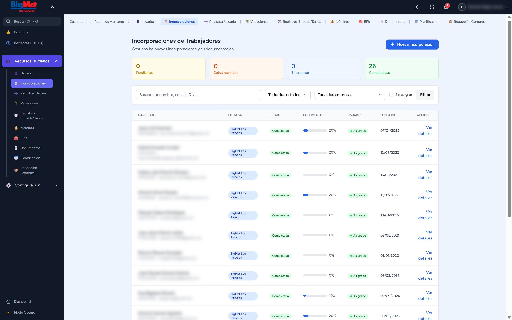

Rellena el formulario con los datos básicos:

- **Empresa destino** (obligatorio) — la empresa a la que se incorpora.
- **Nombre** (obligatorio).
- **Primer apellido** y **Segundo apellido** (opcionales en este punto; el candidato los confirmará).
- **Teléfono** (obligatorio) — se usa para enviarle el enlace por WhatsApp.

Pulsa **«Crear Incorporación»**.

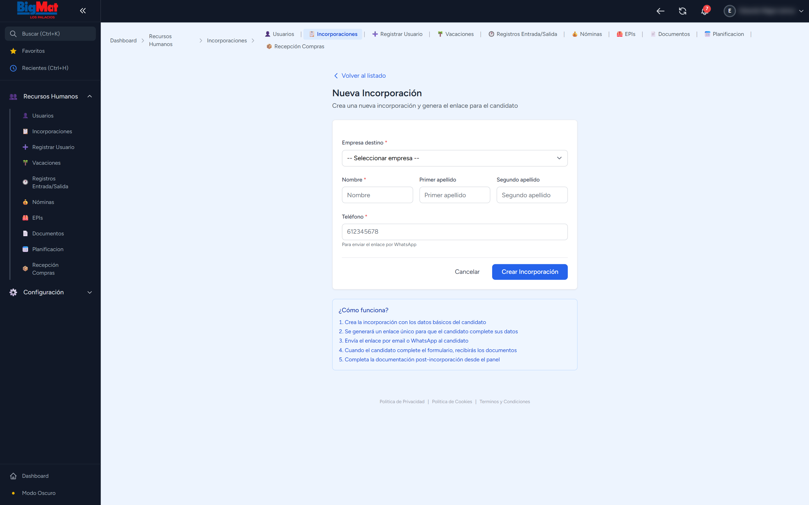

> La nueva incorporación nace en estado **Pendiente**: aún falta que el candidato complete sus datos.

### Paso 2 — Enviar el enlace al candidato

Al crear la incorporación entrarás en su ficha de detalle. En la sección **«Enlace del formulario»** verás la dirección única del candidato, con un botón para **copiarla**.

Cópiala y envíasela al candidato por **WhatsApp** o email. Cuando lo hayas hecho, puedes pulsar **«Marcar como enviado»** para dejar constancia de la fecha de envío.

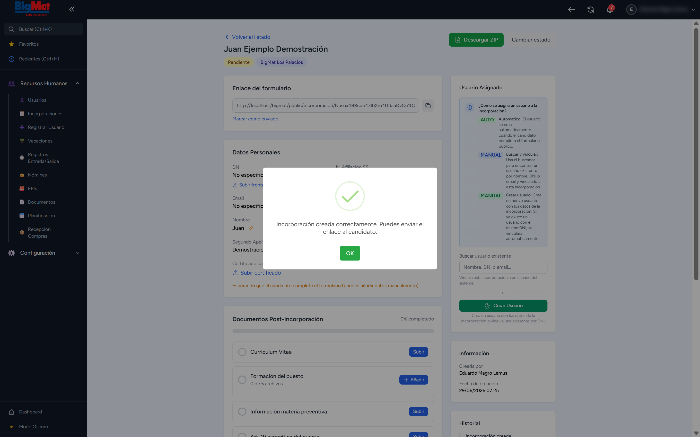

### Paso 3 — El candidato rellena el formulario

El candidato abre el enlace (no necesita tener cuenta) y ve el **Formulario de Incorporación** con el nombre de la empresa. Está dividido en secciones:

**1. Documento de Identidad**
- Foto del **DNI/NIE por delante** y **por detrás** (obligatorias).
- **DNI/NIE**, **Nombre**, **Primer apellido** y **Segundo apellido**, escritos a mano (deben coincidir exactamente con el documento).

**2. Datos Personales**
- **Nº de Afiliación a la Seguridad Social**.
- **Correo electrónico** y **Teléfono**.
- **Certificado de titularidad de la cuenta bancaria** (el certificado oficial del banco, no una captura).

**3. Documentación de Formación** (opcional)
- Posibilidad de adjuntar cursos o certificados de formación del puesto («Otros cursos»). El candidato puede añadir varios.

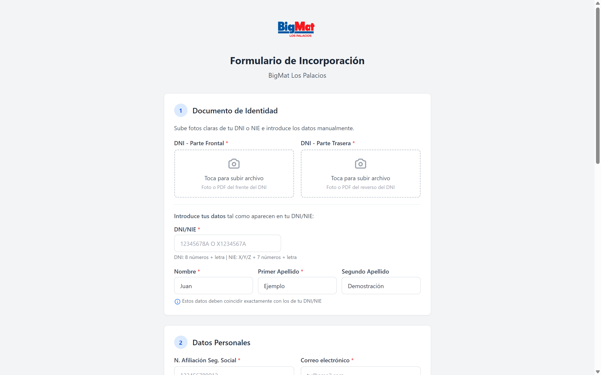

Al terminar pulsa **«Enviar documentación»** y ve una pantalla de confirmación con el resumen de lo enviado.

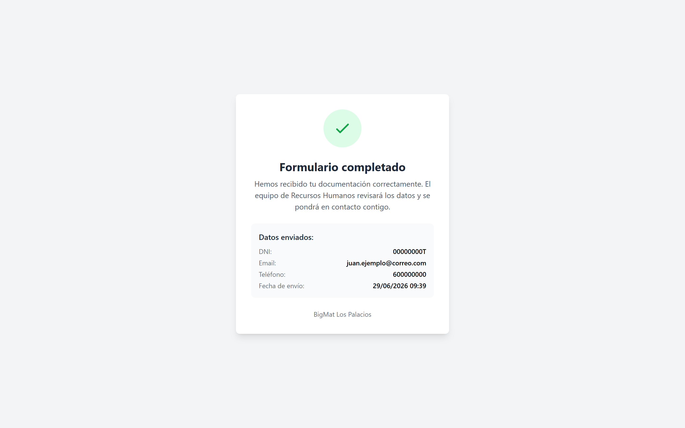

### Paso 4 — El usuario se crea automáticamente

En cuanto el candidato envía el formulario:

- La incorporación pasa al estado **«Datos recibidos»**.
- Se crea **automáticamente su usuario** en la aplicación.
- La **contraseña inicial** del usuario son **los números de su DNI** (sin la letra). Conviene avisarle de que la cambie al entrar por primera vez.

> Si ya existiera un usuario con ese mismo DNI, el sistema lo **reutiliza y vincula** en lugar de crear uno duplicado.

### Paso 5 — Completar la documentación post-incorporación

Desde la ficha de la incorporación, Recursos Humanos sube el resto de documentos del expediente. La sección **«Documentos Post-Incorporación»** muestra una lista de verificación con una barra de progreso:

- Currículum Vitae
- Formación del puesto (hasta 5 archivos)
- Información en materia preventiva
- Art. 19 específica del puesto
- Certificado de aptitud médica
- Documento de entrega de EPIs
- Contrato de trabajo (hasta 10 archivos; incluye la fecha de incorporación)
- IDC
- Huella de contrato (SEPE)
- TA2 (Alta del trabajador)

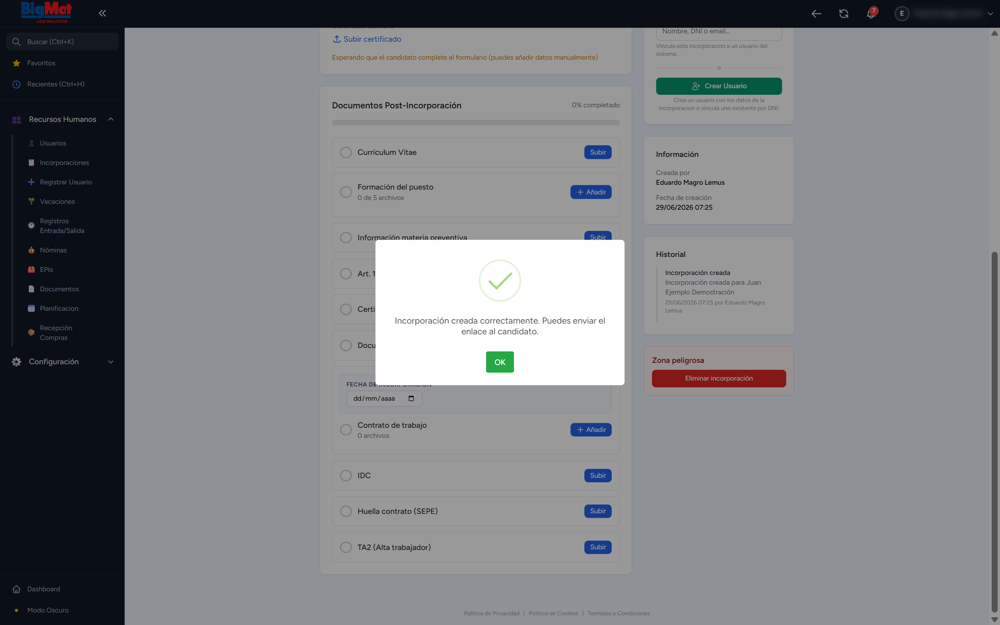

A medida que se suben los documentos, el progreso avanza hasta que el expediente queda **Completado**.

## 5. Vía alternativa: registro directo de usuario

Esta vía crea el usuario **directamente**, sin enviar el formulario al candidato. Úsala solo cuando ya dispongas de todos los datos y no proceda el flujo de incorporación con enlace.

> **Importante:** esta opción está restringida. Solo el departamento de **Programador** puede registrar usuarios directamente. Si no tienes permiso, verás el aviso: *«No tienes los permisos necesarios. Solo el departamento de programador puede registrar usuarios.»*

### Cómo hacerlo

Entra en **Recursos Humanos → Registrar Usuario**. Verás el formulario **«Crear Nuevo Usuario»**, organizado en secciones:

**Datos Personales**
- **Nombre** (obligatorio)
- **Primer Apellido** (obligatorio)
- **Segundo Apellido** (opcional)
- **DNI** (obligatorio)

**Contacto**
- **Email** (obligatorio)
- **Móvil Personal** y **Móvil Empresa** (opcionales)

**Información Laboral**
- **Empresa** (obligatorio)
- **Rol** (obligatorio): Operario, Oficina, Transportista o Visitante
- **Categoría** (obligatorio)
- **Turno** (opcional): Nocturno, Diurno o Mañana

**Seguridad**
- **Contraseña** y **Confirmar Contraseña** (obligatorias)

Pulsa **«Registrar Usuario»**.

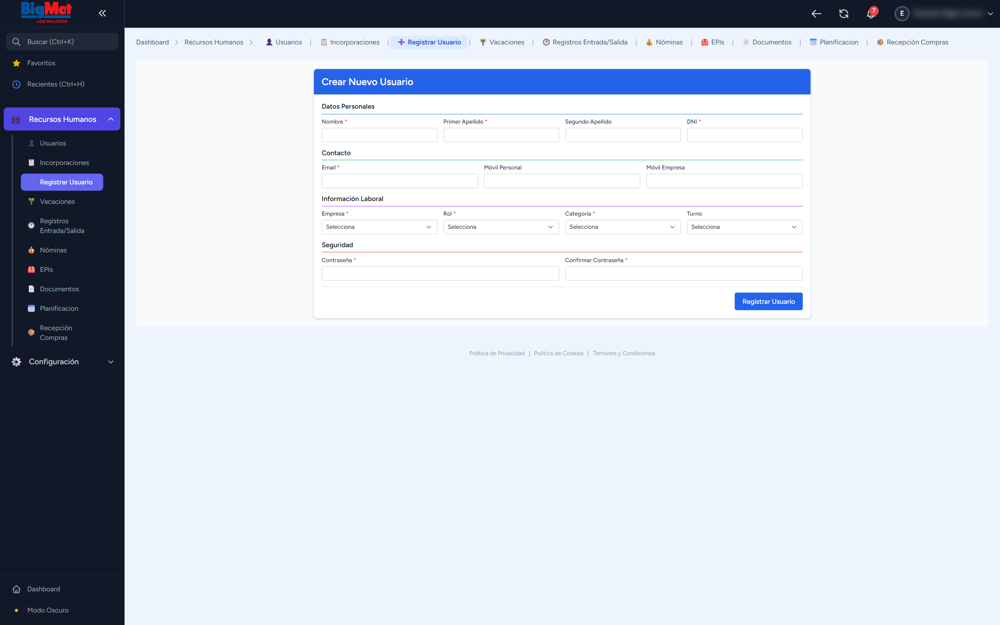

### Qué ocurre al guardar

Al registrar el usuario, la aplicación **crea también, de forma automática, su incorporación** vinculada:

- Hereda los datos personales que acabas de introducir (nombre, DNI, email, teléfono, empresa).
- Nace en estado **«Datos recibidos»**, igual que si el candidato hubiera completado el formulario.
- Queda lista en el módulo de **Incorporaciones** para que le añadas la documentación (contrato, formación, EPIs…).

Así, aunque hayas usado la vía directa, la persona también tiene su expediente de incorporación, sin pasos adicionales.

## 6. Seguimiento: estados y documentación

### Estados de una incorporación

Cada incorporación pasa por una serie de estados que indican en qué punto está el proceso:

| Estado | Color | Qué significa |
|---|---|---|
| **Pendiente** | Amarillo | Creada; falta que el candidato complete sus datos |
| **Datos recibidos** | Naranja | El candidato envió el formulario (o se registró directamente) |
| **En proceso** | Azul | Se está tramitando la documentación |
| **Completada** | Verde | Expediente terminado |
| **Cancelada** | Rojo | Proceso anulado |

El estado se muestra como una **etiqueta de color** en el listado y en la ficha. Desde la ficha puedes cambiarlo manualmente con el botón **«Cambiar estado»**.

### El listado de incorporaciones

En **Recursos Humanos → Incorporaciones** tienes una vista general con:

- **Tarjetas de resumen**: Pendientes, Datos recibidos, En proceso y Completadas.
- **Filtros**: por texto (nombre, email o DNI), por estado, por empresa y «Sin asignar».
- **Tabla** con candidato, empresa, estado, progreso de documentos, si tiene usuario asignado y la fecha de incorporación.

### Asignar usuario manualmente

En la ficha, la sección **«Usuario Asignado»** permite, además del modo automático:

- **Buscar y vincular**: localizar un usuario existente por nombre, DNI o email y enlazarlo a la incorporación.
- **Crear Usuario**: crear el usuario con los datos de la incorporación (si ya existe uno con el mismo DNI, lo vincula).

### Descargar el expediente

El botón **«Descargar ZIP»** de la ficha descarga todos los documentos de la incorporación en un único archivo comprimido.

## 7. Acceso y permisos

- El menú **Recursos Humanos** (con **Incorporaciones** y **Registrar Usuario**) está visible para perfiles con acceso de gestión (Administrador, Administración, Programador y responsables de departamento).
- **Registrar Usuario** (registro directo) está limitado al departamento de **Programador**.
- La gestión de incorporaciones está disponible para el personal de Recursos Humanos autorizado.

## 8. Preguntas frecuentes

**¿Qué contraseña tiene el trabajador la primera vez?**
Si el usuario se creó desde una incorporación (vía recomendada), su contraseña inicial son **los números de su DNI** (sin la letra). Conviene que la cambie al entrar. Si se creó por registro directo, la contraseña es la que se haya escrito en el formulario.

**El candidato ya existía como usuario, ¿se duplica?**
No. Si ya hay un usuario con ese DNI, el sistema lo **reutiliza y lo vincula** a la incorporación (y lo reactiva si estaba dado de baja).

**¿Tengo que crear la incorporación a mano si registro al usuario directamente?**
No. Al registrar un usuario directamente, su incorporación se crea **automáticamente** con los datos personales ya rellenos.

**¿Puedo completar yo los datos en lugar del candidato?**
Sí. En la ficha de la incorporación puedes editar manualmente los datos personales y subir los documentos, sin esperar al formulario.

**¿Cómo le envío el enlace al candidato?**
Cópialo desde la sección «Enlace del formulario» de la ficha y mándaselo por WhatsApp o email. El teléfono que indicaste al crear la incorporación facilita el envío por WhatsApp.

## 9. Referencia rápida

### Las dos vías de un vistazo

- **Nueva contratación →** Recursos Humanos → Incorporaciones → **Nueva Incorporación** → enviar enlace → el candidato rellena → usuario creado automáticamente → completar documentación.
- **Caso puntual con todos los datos →** Recursos Humanos → **Registrar Usuario** → rellenar y guardar → usuario + incorporación creados automáticamente.

### Documentos del expediente

DNI (delante y detrás) · Certificado bancario · Nº afiliación SS · CV · Formación del puesto · Información preventiva · Art. 19 · Aptitud médica · Entrega de EPIs · Contrato de trabajo · IDC · Huella SEPE · TA2.

### Estados

Pendiente → Datos recibidos → En proceso → Completada *(o Cancelada)*.

# Parte 2 — Gestión de trabajadores

## 10. El listado de usuarios

Se accede desde **Recursos Humanos → Usuarios**. Solo el personal de **oficina** ve este listado; el resto de usuarios entra directamente a su propia ficha.

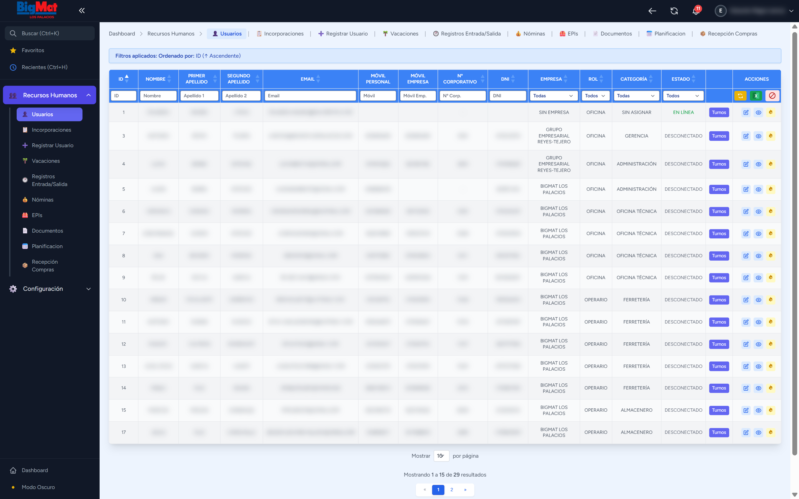

### Buscar y filtrar

Cada columna tiene su filtro en la fila superior de la tabla y se aplica al instante:

- **Texto**: ID, Nombre, Primer apellido, Segundo apellido, Email, Móvil personal, Móvil empresa, Nº corporativo y DNI.
- **Desplegables**: Empresa, Rol, Categoría y Estado.

Puedes combinar varios filtros a la vez; los filtros activos aparecen como etiquetas encima de la tabla. El botón amarillo **↻ (Restablecer filtros)** los limpia todos.

### Ordenar

Pulsa en la cabecera de una columna para ordenar ascendente/descendente: ID, Nombre, Email, Nº corporativo, DNI, Empresa, Rol, Categoría y Estado.

### Estado de conexión

La columna **Estado** indica si la persona está **En línea** (verde) o **Desconectado** (gris).

### Editar un usuario sin salir del listado

**Doble clic** sobre una fila (o el botón **✏️ Editar**) la pone en modo edición. Se pueden modificar: nombre, apellidos, email, móviles, nº corporativo, DNI, empresa, rol y categoría.

- Guarda con el botón **✓ (verde)** o pulsando **Enter**; descarta con **✗ (rojo)**.
- ⚠️ El **DNI** y el **Email** solo los pueden editar los departamentos **Programador** o **Administrador**.

### Acciones por fila

- **✏️ Editar** — activa la edición en línea.
- **👁 Ver perfil** — abre la [ficha del trabajador](#11-la-ficha-del-trabajador).
- **⚙️ Configuración** — abre la vista **«Administración de Perfil»** del trabajador, con las acciones avanzadas (cambiar contraseña, cerrar sesiones y despedir). Se explica en detalle en [La vista de Configuración](#la-vista-de-configuración).
- **Turnos** — genera turnos a partir de una plantilla, en dos pasos: **1)** elegir la **plantilla** (agrupación de turnos) y **2)** elegir el **lugar de trabajo (obra)**. Se generan los turnos hasta fin de año, saltando festivos, vacaciones y días no laborables.

### Barra de acciones (cabecera de la tabla)

- **↻ Restablecer filtros**.
- **Exportar a Excel** (icono verde) — descarga el listado **con los filtros aplicados** en un archivo `.xlsx`.
- **🚫 Despedidos** (icono rojo) — abre la vista de **trabajadores dados de baja** (ver/readmitir).

### La vista de Configuración

El botón **⚙️ Configuración** de cada fila abre la pantalla **«Administración de Perfil»** del trabajador. Es donde están las acciones avanzadas que **no** aparecen en la ficha. Se compone de tres bloques:

**1. Actualizar contraseña**

Define una nueva contraseña para el trabajador. Rellena **Contraseña actual**, **Nueva contraseña** y **Confirmar contraseña**, y pulsa **«Guardar»**.

**2. Cerrar sesiones activas**

El botón **«🛑 Cerrar sesiones activas»** cierra todas las sesiones abiertas del trabajador (lo expulsa de todos los dispositivos donde tenga la sesión iniciada). Debajo se listan sus **sesiones activas**, cada una con su **IP**, **navegador** y **fecha de última actividad**.

**3. Despedir trabajador**

El botón **«⚠️ Despedir trabajador»** da de baja digital a la persona (pide confirmación antes de ejecutarse). Es una acción **irreversible desde la interfaz** que, de forma automática:

- Revoca su acceso a la plataforma.
- Cierra sus sesiones activas.
- Cancela sus turnos futuros.
- Anula los movimientos pendientes que tuviera asignados.
- Guarda la fecha de baja y lo marca como **despedido**.

Si el trabajador ya está despedido, en lugar del botón se muestra la **fecha de su baja**. Para volver a darle acceso, usa **🚫 Despedidos** en la cabecera del listado (ver/readmitir).

### Paginación

El listado se pagina automáticamente (15 registros por página).

### En el móvil

El listado se muestra como **tarjetas de contacto**. Al tocar una se abre una ficha con accesos rápidos: **llamar** (móvil personal, de empresa o corporativo), **WhatsApp**, **email** y **ver perfil**. También permite editar los datos básicos.

## 11. La ficha del trabajador

Es la pantalla de detalle de una persona, a la que se llega con **👁 Ver perfil** desde el listado. Reúne sus datos, su **calendario** de turnos y fichajes, y las acciones de gestión. Es la **misma pantalla** que cada trabajador ve como [Mi perfil](#13-mi-perfil); lo que se puede hacer depende de **quién** la esté mirando.

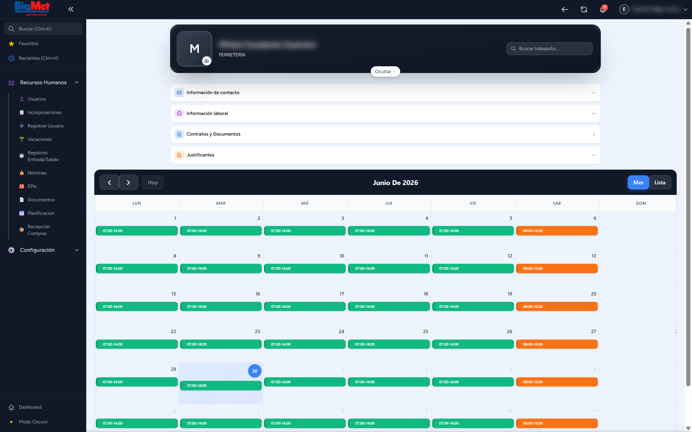

### Cabecera

- **Foto de perfil** — el icono de cámara permite **cambiar la foto** (tu propia foto; la oficina/administración puede cambiar la de otros).
- **Fichar Entrada / Salida** — botones verde y rojo, solo en **tu propia** ficha. Registran la entrada o salida con geolocalización.
- **Buscador de trabajador** (solo oficina) — salta rápidamente a la ficha de otra persona.
- **Ver más / Ocultar** — despliega o contrae las secciones de detalle.

### Información que se muestra

- **Contacto**: email y teléfonos.
- **Laboral**: empresa, categoría, **horas trabajadas** (semana y mes, calculadas a partir de los fichajes), **vacaciones** (totales / disfrutadas / disponibles por año) y **ausencias** (injustificadas, justificadas y días de baja).
- **Departamentos** (solo oficina): departamentos a los que pertenece y su rol departamental.

### Contratos y Documentos

El botón **«Contratos y Documentos»** (oficina o el propio usuario) abre un modal para:

- **Ver y descargar** los contratos de la incorporación.
- **Fecha de incorporación**: se muestra y, si no hay una incorporación vinculada, la **oficina** puede establecerla (se usa para calcular las vacaciones).

### Solicitar nómina *(tu propia ficha)*

En la sección **«Solicitar Nómina»** eliges un mes y se te envía la nómina por email.

### Solicitudes de vacaciones pendientes

Muestra tus solicitudes pendientes; puedes **eliminar** una solicitud (con confirmación).

### Subir justificante *(operario / oficina)*

La sección **«Subir Justificante»** sirve para justificar ausencias: subes el documento (PDF o imagen), el sistema intenta **detectar la fecha automáticamente (OCR)**, indicas las **horas justificadas** y, si quieres, observaciones. Al guardarlo se avisa a RRHH y Producción. La oficina puede **consultar** los justificantes de otros (no subirlos).

### Privacidad y consentimiento *(tu propia ficha)*

Permite consultar las políticas (**Privacidad**, **Cookies**, **Términos**) y, si lo deseas, **revocar el consentimiento** (cierra la sesión y obliga a aceptarlas de nuevo para volver a entrar).

### Calendario de turnos

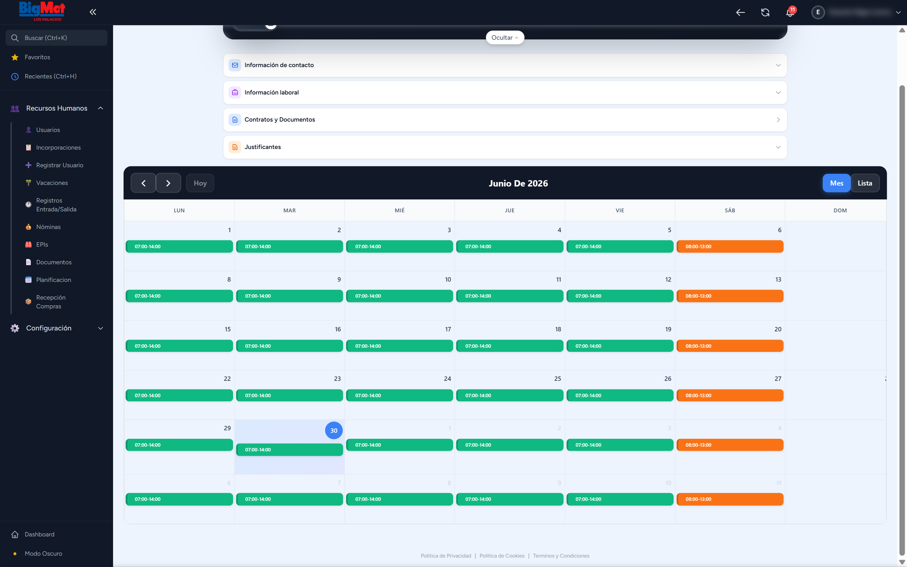

Muestra turnos, fichajes (entrada/salida), vacaciones, estados y festivos. Permite:

- **Navegar** (anterior / siguiente / hoy) y **cambiar la vista** (mes, semana, día o lista).
- **Seleccionar un rango** (clic en el día inicial y clic en el día final) para:
  - **Solicitar vacaciones** — solo en **semanas completas** (de lunes a domingo) y si te quedan días disponibles.
  - **Pedir revisión de fichajes** — muestra un resumen de los fichajes del rango y permite añadir observaciones.

### Acciones de oficina sobre un trabajador

Cuando es la **oficina** quien mira la ficha de otra persona, la acción de gestión disponible **en la propia ficha** es:

- **Gestión de jornada** (clic en un día del calendario): asignar o editar el **turno**, el **estado** (curso, vacaciones, baja, justificada, injustificada) y las **horas** de la 1ª y 2ª jornada; o **eliminar** el turno/estado. Al elegir **justificada** o **injustificada** aparece un campo de **comentario** para anotar el motivo (ver [Comentario en una falta](#15-justificantes-y-control-de-ausencias)).

El resto de acciones de gestión sobre el trabajador están en otras pantallas, todas a un clic desde el **listado de usuarios**:

- **Cambiar contraseña**, **cerrar sesiones** y **despedir** → botón **⚙️ Configuración** (ver [La vista de Configuración](#la-vista-de-configuración)).
- **Generar turnos** desde una plantilla → botón **Turnos** del listado.
- **Readmitir** a un trabajador despedido → vista **🚫 Despedidos**.

## 12. Planificación de turnos

La vista **Recursos Humanos → Planificacion** es un **tablero de turnos** con forma de calendario tipo línea de tiempo: cada **fila es un trabajador** y cada **bloque de color es un turno** asignado. Sirve para ver de un vistazo la planificación de toda la plantilla y reorganizarla.

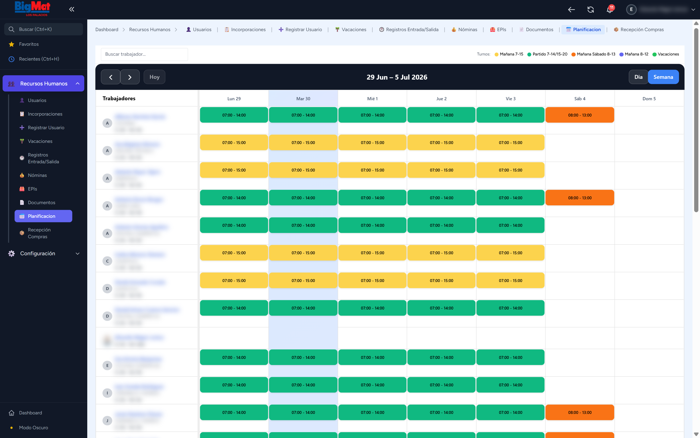

### Qué se ve

- **Filas (trabajadores):** cada trabajador activo, con su **foto**, **nombre**, **categoría** y las **horas reales fichadas** (`S:` esta semana · `M:` este mes). Solo aparecen los trabajadores que tu perfil tiene permiso de ver.
- **Bloques (turnos):** cada asignación se pinta con el **color de su turno** y muestra su **horario** (p. ej. `07:00 - 15:00`).
- **Estados especiales:** vacaciones, baja, justificada, injustificada y curso se muestran con su propio color en lugar del horario.
- **Festivos:** aparecen en rojo y **no se pueden mover**.
- **Leyenda de Turnos:** arriba a la derecha, con el color de cada turno.

### Navegar y filtrar

- **Vistas:** botones **Semana** y **Día** (arriba a la derecha). La vista **Día** muestra el detalle hora a hora.
- **Desplazamiento:** **‹ ›** para avanzar/retroceder y **Hoy** para volver a la fecha actual. La aplicación recuerda la última vista que usaste.
- **Buscar trabajador:** el cuadro de la esquina superior izquierda filtra las filas por nombre.

### Acciones sobre los turnos

- **Crear un turno** — **doble clic** sobre una celda vacía (el día de un trabajador). Se abre el modal **«Asignar turno»**, que muestra el trabajador y la fecha; **pulsa el turno** que quieras de la lista (con su color y horario) y se asigna al instante.
  - Cada trabajador solo puede tener **un turno o estado por día**. Si el día ya está ocupado, la aplicación avisa de que primero debes **eliminar** el turno existente.
- **Mover un turno** — **arrastra** el bloque a otro día (siempre del **mismo trabajador**; no se puede pasar a otra persona). En la vista **Día**, si lo sueltas en otra franja horaria, el turno cambia al que corresponda a esa hora.
- **Eliminar un turno** — **clic derecho** sobre el bloque y pulsa **«🗑️ Eliminar turno»** (pide confirmación).
- **Ir a la ficha** — **clic** sobre un turno (o sobre el **nombre** del trabajador en su fila) abre la [ficha del trabajador](#11-la-ficha-del-trabajador).

> Desde aquí puedes **crear, reorganizar y eliminar** turnos uno a uno. Para **generar muchos turnos de golpe** a partir de una plantilla, usa el botón **Turnos** del [listado de usuarios](#10-el-listado-de-usuarios); para una asignación puntual también dispones de la **Gestión de jornada** en el calendario de la ficha.

## 13. Mi perfil

«Mi perfil» es **tu propia ficha de trabajador**: la misma pantalla del capítulo anterior aplicada a ti. Como trabajador, desde aquí puedes:

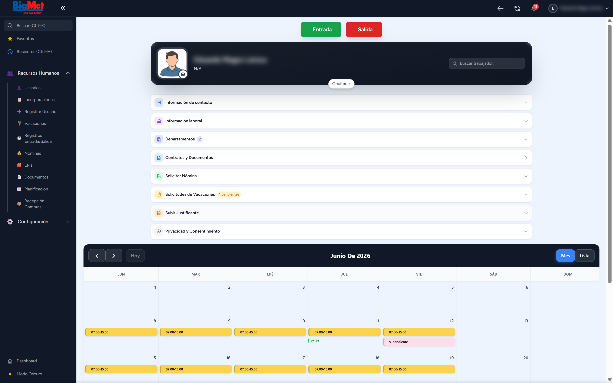

- **Fichar Entrada y Salida** (con geolocalización).
- **Cambiar tu foto** de perfil.
- Consultar tus **datos**, tus **horas** trabajadas (semana y mes), tus **vacaciones** y tus **ausencias**.
- **Solicitar vacaciones** y **pedir revisión de fichajes** desde el calendario (seleccionando un rango de fechas).
- **Solicitar tu nómina** de un mes (te llega por email).
- **Subir justificantes** de ausencias.
- **Ver y descargar** tus contratos y documentos.
- Gestionar tu **consentimiento** de privacidad.

> Es el mismo calendario y las mismas secciones que ve la oficina, pero solo sobre tus propios datos y **sin** las acciones de gestión (asignar turnos, despedir, etc.).

# Parte 3 — Vacaciones, ausencias y expedientes

## 14. Vacaciones: solicitud y aprobación

Las vacaciones tienen **dos caras**: la del **trabajador**, que las solicita desde su ficha, y la de la **oficina**, que las aprueba, deniega o asigna desde el panel de **Vacaciones**.

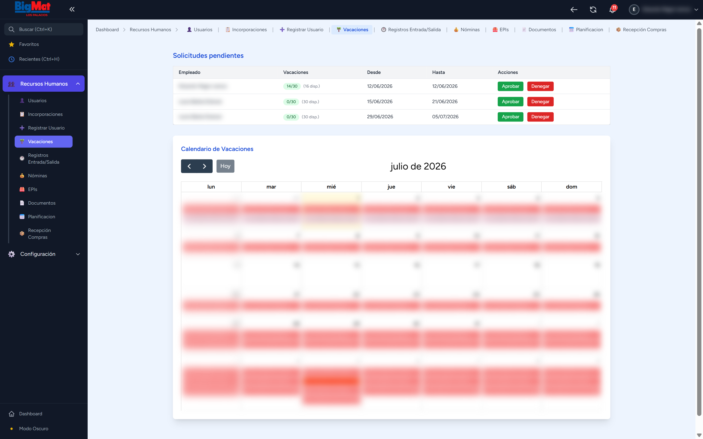

### Cuántos días corresponden (cupo y fecha de incorporación)

La base estándar son **30 días** de vacaciones al año. El cupo de cada trabajador se calcula automáticamente teniendo en cuenta su **fecha de incorporación**:

- Si se incorporó en un **año anterior** (o no consta fecha), le corresponden los **30 días** completos.
- Si se incorpora **durante el año en curso**, el cupo se **prorratea** de forma proporcional a los días que trabajará ese año (por ejemplo, quien entra a mitad de año dispone de aproximadamente la mitad de los días).
- Si la fecha de incorporación es **futura**, el cupo de ese año es **0** hasta que llegue.

> La fecha de incorporación se establece en el **contrato** de su [ficha de incorporación](#16-la-ficha-de-incorporación-ver-información) (o desde **Contratos y Documentos** en la ficha del trabajador). Por eso es importante registrarla: de ella depende el número de días de vacaciones que el sistema le permite disfrutar.

### Cómo solicita vacaciones el trabajador

Desde el **calendario** de su propia ficha (ver [La ficha del trabajador](#11-la-ficha-del-trabajador)):

1. **Selecciona un rango**: clic en el día inicial y clic en el día final.
2. Confirma la solicitud.

Condiciones que comprueba el sistema:

- Solo se pueden pedir **semanas completas** (de **lunes a domingo**).
- Debe **quedar cupo disponible** (días que corresponden − ya disfrutados − pendientes de aprobar).

La solicitud queda **pendiente** y aparece en el panel de la oficina. El trabajador puede ver y **eliminar** sus solicitudes pendientes desde su ficha.

### El panel de la oficina

Se accede desde **Recursos Humanos → 🌴 Vacaciones**. Cuando hay solicitudes sin resolver, el menú muestra un **contador** junto a «Vacaciones». La pantalla tiene dos partes:

**1. Solicitudes pendientes** (tabla superior)

Cada fila es una solicitud, con:

- **Empleado**.
- **Vacaciones**: una etiqueta `usadas/totales` que cambia de color según los días que le quedan — **verde** (le quedan más de 5), **amarillo** (le quedan 5 o menos) y **rojo** (sin días disponibles) — junto al número de días disponibles.
- **Desde** y **Hasta**: el rango solicitado.
- **Acciones**: botones **Aprobar** (verde) y **Denegar** (rojo).

**2. Calendario de Vacaciones** (debajo)

Muestra todas las vacaciones asignadas (en rojo) y los **festivos**. Sirve para tener la visión global del equipo y para gestionar vacaciones directamente sobre él.

> Tanto la tabla como el calendario muestran **solo los trabajadores que tu perfil tiene permiso de ver**.

### Aprobar o denegar una solicitud

- **Aprobar**: si el trabajador tiene **días sin disfrutar del año anterior**, el sistema pregunta primero **a qué año imputar** las vacaciones (año actual o año anterior), o permite cancelar. Tras elegir, la solicitud se aprueba, los días se reflejan en el calendario y la fila desaparece de pendientes.
- **Denegar**: rechaza la solicitud y la quita de la lista.

En ambos casos se muestra un aviso de confirmación.

### Asignar vacaciones directamente (sin solicitud previa)

La oficina puede asignar vacaciones a alguien sin esperar a que las pida, desde el propio calendario:

1. **Clic en el día inicial** y **clic en el día final** del rango (se resalta la selección).
2. Se abre un buscador de **empleados**; cada uno muestra su etiqueta `usadas/totales` con el color de disponibilidad. Selecciona a la persona.
3. Si tiene días sobrantes del año anterior, se pregunta a qué año imputarlos.
4. Se asignan las vacaciones y aparecen en el calendario.

### Reorganizar o eliminar vacaciones en el calendario

- **Mover**: **arrastra** un día de vacaciones a otra fecha para reprogramarlo (los festivos no se pueden mover).
- **Eliminar**: **clic derecho** sobre un día de vacaciones y confirma para quitarlo.
- **Ir a la ficha**: **clic** sobre unas vacaciones abre la ficha de ese trabajador.

> **Permisos:** el panel de Vacaciones es una pantalla de gestión (perfil de **oficina** / Recursos Humanos). Cada trabajador solo solicita y consulta las **suyas** desde su ficha.

## 15. Justificantes y control de ausencias

Cuando un trabajador falta, su día queda marcado con un **estado**. Si la falta está justificada, se aporta el **justificante** (un documento) para dejar constancia.

### Estados de un día

| Estado | Qué significa | Color en el calendario |
|---|---|---|
| **Activo** | Día trabajado con normalidad | el de su turno |
| **Injustificada** | Falta sin justificar | rojo |
| **Justificada** | Falta con justificante aportado | verde |
| **Baja** | Baja médica | naranja |
| **Vacaciones** | Día de vacaciones | rojo claro |
| **Curso** | Formación / curso | violeta |

En la ficha de cada trabajador, el bloque de **ausencias** resume el año en curso con tres contadores: **injustificadas**, **justificadas** y **días de baja**.

### Comentario en una falta (motivo)

En las faltas —**justificada** e **injustificada**— se puede anotar un **comentario** de texto libre que explique el **motivo** (por ejemplo, «no avisó ni presentó justificante» o «cita médica con parte»). Se gestiona desde la ficha del trabajador:

1. En el **calendario**, haz clic en el día para abrir el modal **«Gestión de jornada»**.
2. En **Estado**, elige **Justificada** o **Injustificada**. Debajo aparece el campo **«Comentario (motivo de la ausencia)»**.
3. Escribe el motivo y pulsa **Guardar**.

El comentario:

- Se muestra **en el propio evento** del calendario, en una línea debajo del estado.
- Aparece también en el **tooltip** al hacer clic sobre el día, como **«Motivo: …»**.
- Se puede **editar** más tarde reabriendo la Gestión de jornada del día (el texto queda precargado).
- Se **borra automáticamente** si el día deja de ser una falta (al cambiarlo a otro estado o a un turno normal, o al quitar el estado).

> Es una anotación interna de gestión. El **justificante** (documento) sigue subiéndose aparte, desde la sección **«Subir Justificante»**; el comentario solo describe el motivo en el calendario.

### Quién puede subir y quién solo consulta

La sección **«Subir Justificante»** aparece en la ficha del trabajador, solo para perfiles **operario** y **oficina**:

- En **tu propia ficha** puedes **subir** justificantes.
- La **oficina**, al mirar la ficha de **otra** persona, entra en modo **solo lectura** (la sección se titula «Justificantes»): puede **consultar** los documentos aportados, pero no subir.

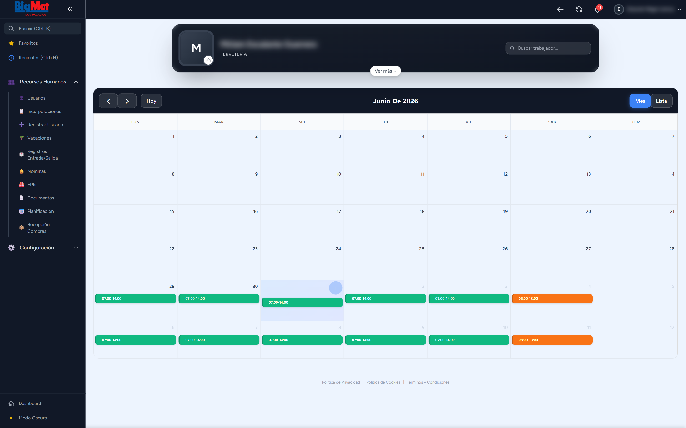

### Cómo subir un justificante (paso a paso)

1. **Selecciona el archivo** del justificante. Se admiten **PDF, JPG y PNG**, hasta **10 MB**.
2. **Detección automática de fecha (OCR)**: si el servidor lo tiene disponible, el sistema **lee el documento e intenta detectar la fecha** automáticamente y la muestra (con un desplegable «Ver texto extraído»). Si no está disponible, se continúa de forma manual.
3. **Elige el día a justificar**:
   - Si hay **días recientes sin justificar** (últimos 60 días), aparece un desplegable **«Asignación a justificar»** con cada día (fecha, turno, obra y estado). Si el OCR detectó la fecha, queda **preseleccionada**.
   - Si no hay días pendientes en la lista, se usa un **selector de fecha** manual (sin permitir fechas futuras).
4. **Horas justificadas** (obligatorio): se introducen **a mano** (admite medias horas). El OCR detecta la fecha, **no** las horas.
5. **Observaciones** (opcional).
6. Pulsa **«Guardar Justificante»**.

### Qué ocurre al guardar

- El documento se archiva en la carpeta del empleado y el **día pasa a estado justificado** (una falta que estaba en rojo pasa a verde).
- Se **avisa automáticamente** a los departamentos de **RRHH** y **Producción** con una alerta interna que incluye al trabajador, el día, las horas y un enlace para **ver el justificante**.

Arriba se mantiene la lista **«Justificantes subidos (últimos 90 días)»**, con la fecha, las horas, las observaciones y un icono para **abrir** cada documento.

## 16. La ficha de incorporación («Ver información»)

Es la pantalla que centraliza **todo el expediente** de una persona: sus datos, sus documentos y el estado del proceso de alta. Es la misma ficha de incorporación de la [Parte 1](#4-vía-recomendada-incorporación-con-enlace), vista aquí como **pantalla de consulta y gestión** del trabajador ya dado de alta.

### Cómo llegar

Desde el **listado de usuarios**, en la columna **Acciones** de cada fila, pulsa el botón **«Ver información»** (icono de información). Te lleva directamente a la ficha de incorporación de esa persona.

> El botón **solo aparece si el trabajador tiene una incorporación asociada**. Como cada alta genera siempre su incorporación (ver [Conceptos clave](#2-conceptos-clave-usuario-e-incorporación)), lo normal es que esté disponible.

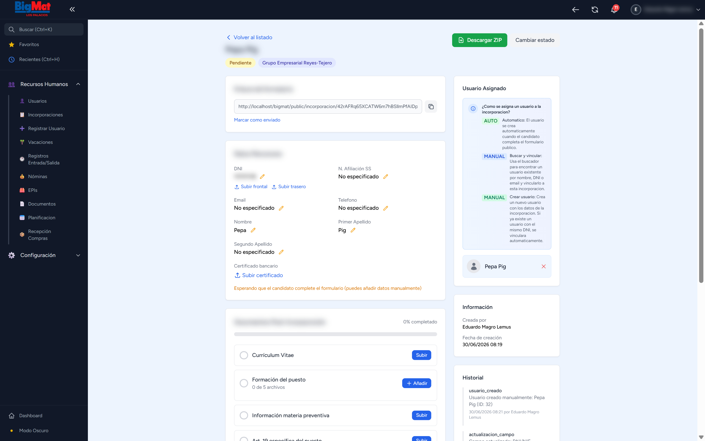

### Qué contiene la pantalla (de arriba a abajo)

**Cabecera** — nombre completo del candidato, **etiquetas de estado** (estado de la incorporación, empresa y puesto) y dos botones: **«Descargar ZIP»** (descarga todos los documentos en un comprimido) y **«Cambiar estado»**.

**Enlace del formulario** — la dirección única del formulario público, con botón para **copiarla**, y la opción de **«Marcar como enviado»** (o la fecha en que se marcó).

**Datos Personales** — DNI/NIE, Nº de afiliación a la SS, email, teléfono, nombre y apellidos. **Cada campo tiene un lápiz** para editarlo. Aquí están también los **documentos del candidato**:

- **DNI** (frontal y trasero) y **certificado bancario**: por cada uno, **Ver**, **resubir** (reemplazar) y **eliminar**; o **subir** si todavía no existe.

**Documentos Post-Incorporación** — una **lista de verificación** con **barra de progreso** (porcentaje completado). Cada documento se marca en verde al completarse. Por cada uno: **Subir** (si falta) o **Ver** / **Eliminar**. Los que aportó el propio candidato aparecen como **«Por candidato»**. Los tipos son:

1. Currículum Vitae
2. Formación del puesto *(varios archivos, hasta 5)*
3. Información en materia preventiva
4. Art. 19 específica del puesto
5. Certificado de aptitud médica
6. Documento de entrega de EPIs
7. Contrato de trabajo *(varios archivos; incluye el campo **Fecha de Incorporación**, que se guarda al cambiarlo)*
8. IDC
9. Huella de contrato (SEPE)
10. TA2 (Alta del trabajador)

> La **Fecha de Incorporación** del contrato es la que usa el sistema para calcular las vacaciones (ver [capítulo 14](#14-vacaciones-solicitud-y-aprobación)).

**Usuario Asignado** (columna lateral) — muestra el usuario vinculado (foto, nombre, email) con opción de **desvincular**; o, si no lo hay, un **buscador** para vincular uno existente y un botón **«Crear Usuario»** (que reutiliza el usuario si ya existe uno con el mismo DNI).

**Información** — quién creó la incorporación, cuándo, y la fecha en que se completaron los datos.

**Historial** — registro cronológico de las acciones realizadas sobre la incorporación.

**Zona peligrosa** — botón **«Eliminar incorporación»** (pide confirmación; borra también sus documentos).

### Formatos y avisos

- Archivos admitidos: **PDF, JPG y PNG** (hasta **10 MB** en documentos post-incorporación; **5 MB** al resubir documentos del candidato).
- Casi todas las acciones piden **confirmación** y, al completarse, refrescan la pantalla con el cambio.

> **Permisos:** es una pantalla de **gestión** (Recursos Humanos / administración). Los **operarios no acceden** a ella.

# Parte 4 — Día a día: fichajes, comunicación y nóminas

## 17. Fichajes y revisión de fichajes

El **fichaje** es el registro de la entrada y la salida de cada trabajador. De él salen las **horas reales** que se ven en la ficha y en la planificación, y es la base del control de asistencia.

### Cómo ficha un trabajador (entrada y salida)

Cada persona ficha desde **su propia ficha** («Mi perfil»). Los operarios entran directamente a esa pantalla al iniciar sesión. Arriba aparecen dos botones grandes:

- **«Entrada»** (verde)
- **«Salida»** (rojo)

Al pulsar uno, el sistema:

1. Pide **confirmación** («¿Quieres registrar una entrada?» → **«Sí, fichar»** / **«Cancelar»**).
2. Solicita la **ubicación GPS** del dispositivo (es **obligatoria**).
3. Busca la **obra más cercana** a esas coordenadas. Si no estás dentro de ninguna **zona de trabajo** configurada, el fichaje se **rechaza** («No estás dentro de ninguna zona de trabajo…»).
4. Si todo es correcto, muestra un aviso verde con el **lugar** (obra) y el **estado** (por ejemplo, «📍 Lugar: … · 📊 Estado: Trabajando»).

> El sistema **detecta solo** a qué turno corresponde el fichaje según la hora (con un margen de anticipación de 2 horas). Si ese día no tenía turno asignado, lo **crea automáticamente** y avisa a los programadores. Si fichas fuera de tu horario, se registra igual pero con un aviso.

**Turno partido (doble jornada).** El sistema admite hasta cuatro marcajes en un día: **entrada → salida → entrada 2 → salida 2**. Al fichar, registra el tramo que corresponda. Algunos avisos habituales:

- «Ya has fichado entrada… ¿Quieres sobrescribir la hora de entrada?»
- «No has fichado la entrada de hoy. ¿Quieres registrar la salida de todas formas?»
- «Para registrar otra salida, primero debes fichar la segunda entrada» (con botón **«Fichar Entrada»**).
- «Ya has completado el turno partido de hoy… No puedes registrar más fichajes».

### El resumen de asistencia (en la ficha)

En la ficha de cada trabajador, el bloque de **resumen** muestra los datos del **año en curso**:

- **Horas trabajadas** (fichajes reales) de la **semana** y del **mes**, con los días trabajados e incompletos.
- **Vacaciones**: totales, disfrutadas y disponibles del año, más las pendientes del año anterior.
- **Ausencias (este año)**: tres contadores — **injustificadas** (rojo), **justificadas** (amarillo) y días de **baja** (gris).

### Estados de un fichaje

Mientras transcurre el día, el fichaje pasa por estas **fases**:

| Fase | Qué significa |
|---|---|
| **Pendiente de entrada** | Aún no ha fichado |
| **Trabajando** | Tiene entrada, falta la salida |
| **En descanso (entre jornadas)** | Tiene salida, falta la 2.ª entrada |
| **En segunda jornada** | Tiene la 2.ª entrada, falta la 2.ª salida |
| **Turno partido completo** | Los cuatro marcajes registrados |

Un día se considera **completo** solo si tiene **entrada y salida**. Cada fichaje guarda además la **obra** en la que se marcó.

### Pedir revisión de fichajes (corregir un día)

Cuando a un trabajador le **falta un fichaje** o hay un error, no lo corrige él mismo: **solicita una revisión** y la resuelve un responsable.

**El trabajador**, desde el **calendario de su ficha**:

1. **Selecciona uno o varios días** en el calendario. Aparece un cuadro «¿Qué deseas hacer?» con dos opciones: **«Solicitar vacaciones»** o **«Pedir revisión de fichajes»**.
2. Al elegir **«Pedir revisión de fichajes»** se muestra una **tabla resumen** de esos días (Fecha, Turno, y las columnas **E**, **S**, **E2**, **S2**), marcando cada día como correcto o incompleto (en rojo).
3. Puede añadir **Observaciones** (opcional) indicando qué necesita corregir.
4. Pulsa **«Enviar solicitud»**.

La solicitud queda **pendiente** y genera una **alerta** dirigida al **responsable de su departamento** (o, si no lo hay, al departamento de **Administración**).

**El responsable** (oficina, programador o responsable del departamento) abre esa alerta y ve el cuadro **«Solicitud de Revisión de Fichajes»** con el detalle día a día y tres botones:

- **«Corregir Fichajes»** (verde) — **auto-rellena**: para cada día del rango con turno asignado, **completa las horas que faltan** (entrada y/o salida) con las horas oficiales del turno. La solicitud pasa a **resuelta** y se avisa al trabajador de los días corregidos.
- **«Denegar»** (rojo) — **exige un motivo** obligatorio. La solicitud pasa a **denegada** y el trabajador recibe el aviso con el motivo.
- **«Ver Perfil»** (azul) — abre la ficha del trabajador.

Una solicitud ya procesada **no se puede volver a tocar** («Esta solicitud ya fue procesada»). Sus estados posibles son **pendiente**, **resuelta** o **denegada**.

> **Corrección directa (alternativa).** Desde el calendario de **planificación**, un gestor puede editar a mano las horas de un día (campos **Entrada** / **Salida**, y una 2.ª jornada con **«+ Añadir»** / **«Quitar»**) y guardar. Esto sobrescribe el fichaje directamente, sin pasar por el flujo de solicitud.

**Permisos.** Fichar es solo para perfiles **operario** y **oficina** (y requiere GPS dentro de una obra). **Solicitar** revisión, cualquier trabajador sobre sus propios días. **Resolver** una revisión (corregir o denegar), solo **oficina**, **programador** o el **responsable del departamento** del solicitante.

## 18. Mensajes internos y firma de documentos

La aplicación incluye una **mensajería interna** (llamada indistintamente «alertas» o «mensajes») para comunicar avisos entre la oficina y los trabajadores, y un módulo para **enviar documentos y recogerlos firmados**.

### Dónde se ven los mensajes

Hay tres puntos de aviso, todos llevan a la misma pantalla de **Mensajes**:

- La **campana** de la barra superior, con un **globo rojo** que indica cuántos mensajes tienes **sin leer**.
- Un **aviso flotante** rojo arriba a la derecha: «🔔 Tienes X mensajes sin leer».
- La **propia bandeja** de mensajes, donde los no leídos aparecen resaltados en amarillo con la etiqueta **«Nuevo»**.

> El contador cuenta **conversaciones** sin leer (no cada respuesta suelta).

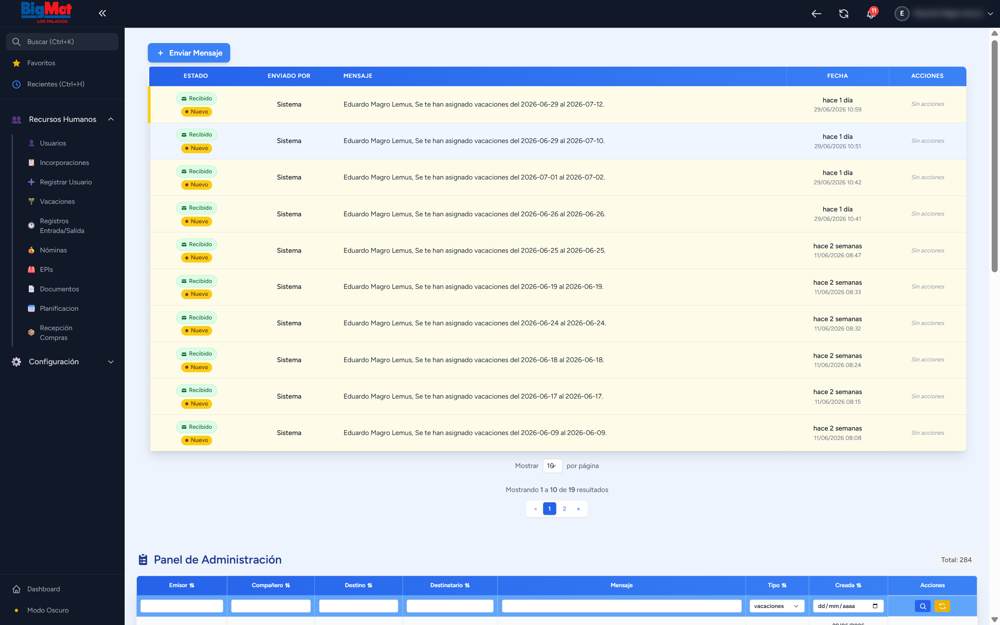

### La bandeja de mensajes

Cada fila es una **conversación** (un mensaje y sus respuestas). Muestra:

- **Estado**: **«Recibido»** (verde) o **«Enviado»** (azul).
- **Enviado por**: el nombre del emisor. Los mensajes de la **oficina** figuran como **«Sistema»**.
- **Mensaje** (recortado, «Clic para ver completo…»), con indicadores del número de **adjuntos** y de **respuestas**.
- **Fecha** y **Acciones** (si es un mensaje que enviaste tú, botón **«Eliminar»**).

### Enviar un mensaje

Con el botón **«Enviar Mensaje»**. El formulario depende del perfil:

- **La oficina / RRHH** elige el **destino** (por **Rol**, por **Categoría** o a un **destinatario concreto**) y puede **adjuntar PDF** marcando **«Requiere firma»**.
- **El resto de trabajadores** solo escriben el texto: su mensaje se envía automáticamente a los departamentos de **Programador** y **Administrador** y a los **responsables de su departamento**.

### La conversación (hilo)

Al abrir un mensaje se despliega la **conversación completa** en burbujas (las tuyas a la derecha, las de la otra persona a la izquierda). Basta **abrirla** para que se marque como **leída** (no hay botón aparte). Puedes **«Contestar»** dentro del hilo; tu respuesta llega a la otra parte del mismo. Cada adjunto muestra los botones **«Ver»** (abre el PDF) y **«Descargar»**.

> Los adjuntos son **solo PDF**, un máximo de **5 por mensaje** y hasta **10 MB** cada uno.

### Documentos a firmar

El módulo **«Documentos Enviados»** (`/documentos-alertas`) es la pantalla de RRHH para **enviar documentos que el empleado debe firmar** (por ejemplo, recibí de EPIs, comunicados, política de empresa) y **auditar** quién ha firmado.

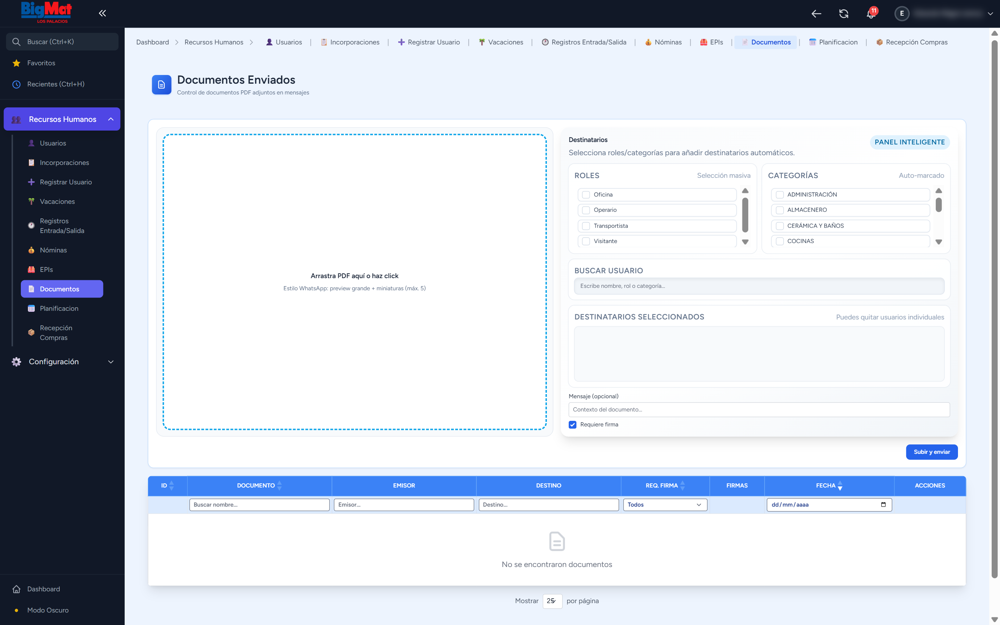

**Enviar un documento a firmar:**

1. **Arrastra el PDF** a la zona de subida (o haz clic). Solo PDF, hasta **5 archivos** y **10 MB** cada uno.
2. Selecciona los **destinatarios**: por **Rol**, por **Categoría** (selección masiva) o buscando **usuarios** uno a uno. Los elegidos aparecen en «Destinatarios seleccionados».
3. Escribe un **mensaje** de contexto (opcional).
4. Deja marcado **«Requiere firma»** (viene activado por defecto).
5. Pulsa **«Subir y enviar»**.

Cada destinatario recibe el documento en su **bandeja de mensajes** con la firma pendiente.

**Cómo firma el empleado** (desde su bandeja de mensajes):

1. Abre el mensaje. Al final aparece un panel naranja **«Documentos pendientes de tu firma»** con los PDF (botón **«Ver PDF»**).
2. Marca la casilla **«Confirmo haber revisado y recibido los documentos»**, que despliega un lienzo **«Dibuja tu firma aquí»** (funciona con ratón o con el dedo en pantalla táctil).
3. Pulsa **«Firmar»** (o **«Borrar»** para repetir). Una sola firma cubre **todos** sus documentos pendientes en ese momento y marca los mensajes como leídos.

**Seguimiento de firmas (tabla de «Documentos Enviados»).** Cada documento muestra si **requiere firma** y un contador **firmadas/total** (verde cuando está completo). Al abrir el detalle («Ver firmas») se ve, por cada usuario, la **fecha/hora** de firma o «Pendiente», la **imagen de la firma** y dos acciones de gestión:

- **«Enviar a los faltantes»** — si hay personas que **entraron después** (nuevas en el rol o categoría) y no tenían la petición, se les puede **asignar la firma** a todas o solo a las seleccionadas.
- **«Revocar firma»** — **anula** una firma ya realizada para que el empleado tenga que **volver a firmar** (pide confirmación).

**Permisos.** Cualquiera puede **leer**, **responder** y **firmar** los documentos que le llegan. **Enviar documentos a firmar** y **gestionar las firmas** (asignar a faltantes, revocar) es propio de **RRHH / administración**. El **Panel de Administración** de mensajes —con la vista de **todas** las conversaciones y filtros avanzados— solo lo ven los usuarios del departamento **Administrador**.

## 19. EPIs: equipos de protección individual

El módulo de **EPIs** lleva el control de los **equipos de protección** que tiene cada trabajador: qué se le ha entregado, cuánto y cuándo, y qué ha devuelto. Todo vive en **una sola pantalla** (`/epis`), que abre el resto de funciones en ventanas emergentes.

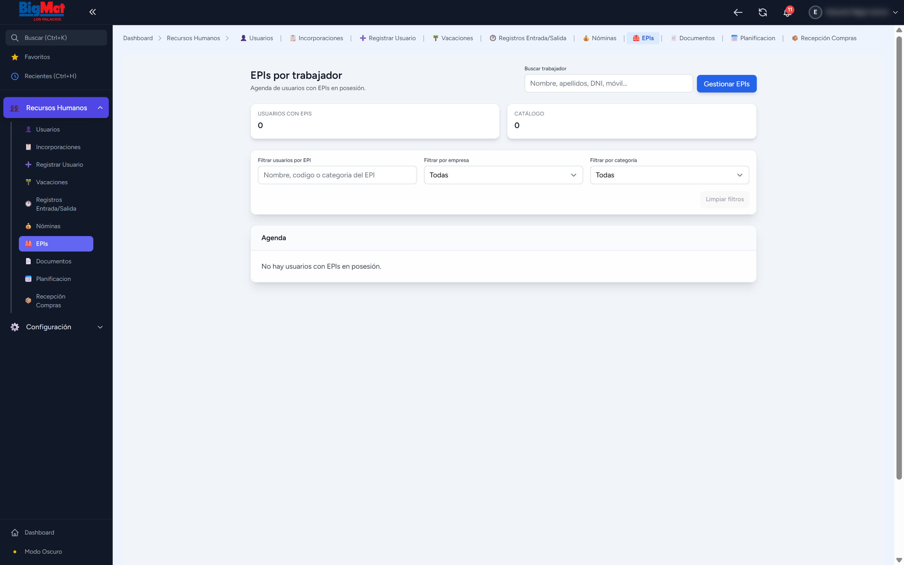

### La pantalla principal («EPIs por trabajador»)

Es una **agenda de trabajadores** (no un almacén de material). De arriba a abajo:

- **Buscador de trabajador** (por nombre, apellidos, DNI o móvil): al elegir a alguien se abre su ficha de EPIs.
- Botón **«Gestionar EPIs»** (abre el catálogo) e **«Importar Excel»**.
- Dos indicadores: **«Usuarios con EPIs»** y **«Catálogo»** (número de EPIs dados de alta).
- **Filtros** de la agenda: por **EPI**, por **empresa** y por **categoría**, con botón **«Restablecer»**.
- La **agenda**: tarjetas de trabajadores ordenadas por cuántos EPIs tienen en posesión, con acceso a su ficha y a su **historial**.

### El catálogo de EPIs

Con **«Gestionar EPIs» → pestaña «Catálogo»** se administran los tipos de EPI.

**Crear un EPI** — formulario con: **Nombre** (obligatorio), **Código** (opcional), **Categoría** (opcional), **Activo**, **Descripción** e **Imagen**. Pulsa **«Crear»**.

**Lista «EPIs en base de datos»** — cada EPI con su imagen (o «Sin img») y botones **«Editar»** y eliminar. Casilla **«Mostrar inactivos»** para ver los desactivados.

> Al **eliminar** un EPI: si **ya tiene asignaciones**, no se borra, solo se marca como **inactivo** (para conservar el historial); si **no** tiene ninguna, se elimina definitivamente. Es decir, un EPI con historial **nunca desaparece**.

### Asignar un EPI a un trabajador

Desde la **ficha del trabajador** (pestaña «usuario»), bloque **«Asignar EPI»**:

1. **Busca el EPI** (por nombre, código o categoría). Los inactivos se marcan como tal.
2. Indica la **Cantidad** y unas **Notas** (opcional).
3. Pulsa **«Asignar»** (queda registrada con la fecha de entrega de hoy).

En esa misma ficha, la sección **«EPIs en posesión»** agrupa lo entregado por producto. Por cada asignación puedes **editar la fecha de entrega**, **marcar como devuelto** (admite **devolución parcial** de la cantidad) o **corregir la fecha de devolución**. El botón **«Historial»** abre el registro completo de entregas y devoluciones, con la etiqueta **«En posesión»** en las activas.

### Importar desde Excel

Con **«Importar Excel»** se cargan asignaciones en bloque desde un `.xlsx` / `.xls`. El formato esperado es **una hoja por trabajador** con: **Nombre** (celda B1), **Apellidos** (B2), **Fecha de entrega** (B5), los **nombres de los EPIs** en la fila 9 (de la columna B en adelante), las **cantidades** en la fila 10 y las **notas** en la fila 11. El sistema localiza a cada trabajador por nombre y apellidos, crea los EPIs que no existan y registra las asignaciones. Al terminar informa de las asignaciones creadas y de los errores por hoja (por ejemplo, «usuario no encontrado»).

### Compras de EPIs

Desde el catálogo, **«Compras»** (ver listado) y **«Hacer compra»** (crear) llevan el **aprovisionamiento** de material (no ligado a un trabajador concreto). Una compra agrupa varios **ítems** (EPI + **Cantidad** + **Precio/epi** opcional), permite adjuntar el **ticket** (imagen o PDF) y tiene dos estados: **pendiente** o **comprada** (**«Marcar comprada»** / **«Marcar pendiente»**). Si a algún ítem le falta el precio, se avisa con «Faltan precios en algunos productos».

**Permisos.** El módulo de EPIs es para **RRHH / administración** y **responsables de departamento**. Los **operarios no acceden** a él.

## 20. Nóminas, contratos y despidos

### Nóminas

La aplicación **reparte** las nóminas del mes entre los trabajadores y les permite **solicitarlas** desde su ficha. El circuito habitual es:

**1. Importar (dividir) las nóminas del mes** — pantalla **«Importar Nóminas»** (`/nominas`).

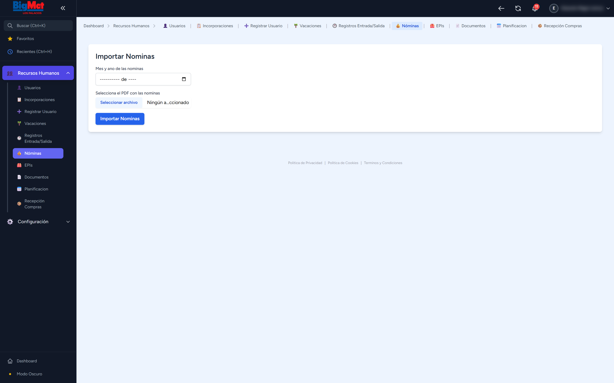

Administración exporta de la gestoría **un único PDF con todas las nóminas del mes** y lo sube aquí:

1. Elige el **mes y año**.
2. Selecciona el **PDF** con las nóminas (hasta **100 MB**).
3. Pulsa **«Importar Nóminas»**.

El sistema **lee cada página, detecta el DNI** de cada trabajador y genera **un PDF individual por persona**, que deja disponible en el servidor. Al terminar avisa: «Nóminas divididas correctamente: X PDFs generados a partir de Y páginas». Además:

- Si algún DNI **no coincide** con ningún trabajador, crea una **alerta** con la lista de «DNIs no encontrados».
- **Notifica a cada trabajador** cuya nómina se importó: «Tu nómina de {mes} {año} ya está disponible. Puedes solicitarla desde tu perfil».

**2. El trabajador solicita su nómina** — en su ficha, sección **«Solicitar Nómina»** (solo visible para uno mismo). Elige el **mes** y pulsa **«Enviar»**.

> Importante: **no es una descarga directa**. El sistema **envía la nómina por correo electrónico** al email del trabajador. Requiere tener email configurado; si no, avisa de que contacte con el departamento de programador. Si no hay nómina de ese mes, lo indica.

> **Cálculo automático (uso interno).** Además de importar PDF, el sistema puede **calcular** las nóminas a partir del **convenio** de cada trabajador, su **Modelo 145**, las tasas de **Seguridad Social** y los tramos de **IRPF**. Existen también pantallas de **simulación** de nómina (desde el bruto y desde el neto). Estas funciones son de administración y quedan fuera del uso diario.

### Descargar el contrato

El trabajador puede **descargar su contrato** de trabajo (`/mi-contrato/descargar`). A diferencia de la nómina, el contrato **sí es una descarga directa**: el sistema toma el documento de tipo **contrato de trabajo** de su incorporación y lo descarga como `contrato_{DNI}.pdf`. También está disponible dentro de su ficha, en la sección de contratos y documentos.

### Despedir y readmitir

**Despedir** un trabajador se hace desde la **edición de su ficha**, sección **«Despedir al trabajador»**. Antes de continuar, un aviso recuerda **qué implica**:

- Revoca su **acceso** a la plataforma y **cierra sus sesiones** activas.
- **Cancela sus turnos futuros** y anula los movimientos pendientes asignados.
- Guarda la **fecha de baja** y lo marca como **despedido**.

Pulsa **«Despedir trabajador»** y confirma («¿Despedir al trabajador?» → **«Sí, despedir»**). El trabajador **pierde el acceso al instante** y **desaparece de los listados** generales (queda archivado). Si vuelves a abrir su ficha, verás en rojo «Este usuario ha sido despedido digitalmente el {fecha}».

> Esta acción es **irreversible desde la interfaz** en el sentido de que los turnos borrados no se recuperan solos (ver readmisión).

**Listado de despedidos** — la pantalla **«Trabajadores Despedidos»** (`/users/despedidos`) reúne a los dados de baja, con sus datos y la **Fecha de Baja**. Se llega desde el listado de usuarios con el botón **«Ver trabajadores dados de baja»**. Cada fila tiene **«Ver»** (su ficha) y **«Readmitir trabajador»**.

**Readmitir** — con el botón verde **«Readmitir trabajador»** y confirmación («¿Readmitir a {nombre}?»). El trabajador **vuelve a estar activo** y recupera el acceso. Un aviso importante: los **turnos futuros que se eliminaron al despedirlo no se restauran**; hay que **asignárselos de nuevo** si los necesita.

**Permisos.**

- **Importar / dividir / generar** nóminas y ver su listado: solo perfiles con **acceso total** (Programador, Administrador, Administración). Los **responsables de departamento no** gestionan nóminas.
- **Solicitar la propia nómina** y **descargar el propio contrato**: **cualquier** trabajador (los suyos).
- **Despedir y readmitir**: **acceso total** y **responsables de departamento**.
- El **listado de despedidos**: solo el rol **oficina**.

# Parte 5 — Configuración de la empresa

## 21. El panel principal y la navegación

Al iniciar sesión, cada persona llega a un sitio distinto según su perfil:

- **Acceso total** (departamentos **Programador**, **Administrador** o **Administración**) y **responsables de departamento** → al **Panel principal** (dashboard).
- **Operarios y usuarios básicos** → directamente a **su propia ficha** («Mi perfil»).

### El Panel principal (dashboard)

Es la pantalla de inicio de RRHH, con el título «Bienvenido a Bigmat - Sistema de Recursos Humanos». Muestra una cuadrícula de **accesos directos** a las secciones principales:

| Tarjeta | Lleva a |
|---|---|
| **Usuarios** | Gestionar empleados |
| **Vacaciones** | Control de vacaciones |
| **Turnos** | Registros de entrada/salida |
| **Nóminas** | Gestión de nóminas |
| **Incorporaciones** | Nuevos empleados |
| **EPIs** | Equipos de protección |
| **Departamentos** | Estructura organizativa |
| **Recepción Compras** | Escaneo QR y recepcionado |
| **Festivos** | Calendario laboral |
| **Configuración** | Empresas y fiscalidad |

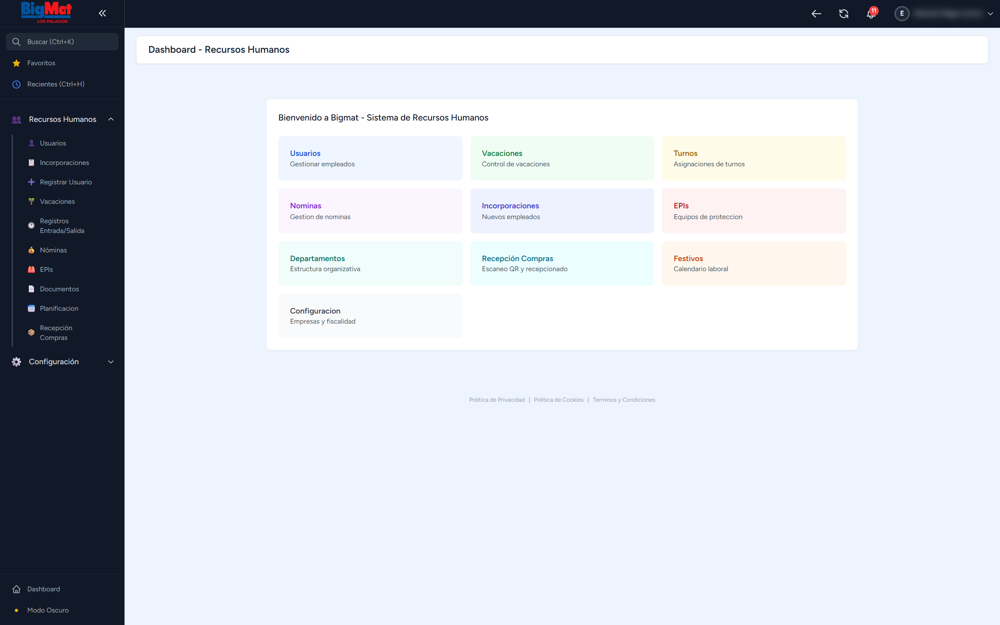

> Todos los perfiles con acceso al panel ven las mismas tarjetas. Si un perfil **no tiene permiso** sobre una sección, al entrar en ella el sistema lo avisa y le impide el paso (el control real es por permisos, no por ocultar la tarjeta).

### El menú lateral y la barra superior

El **menú lateral** (que se muestra solo a perfiles de **oficina / administración**) organiza la aplicación en dos grandes bloques:

- **Recursos Humanos**: Usuarios · Incorporaciones · Registrar Usuario · Vacaciones · Registros Entrada/Salida · Nóminas · EPIs · Documentos · Planificación · Recepción Compras.
- **Configuración**: Ajustes · Departamentos y permisos.

Las opciones sobre las que tu perfil **no tiene permiso** aparecen **atenuadas con un candado**. A los **responsables de departamento** se les bloquean las opciones de **Configuración**.

El menú incluye además un **buscador global** (atajo `Ctrl+K`), accesos a **Favoritos** y **Recientes** (`Ctrl+H`), y un conmutador **Modo Oscuro / Modo Claro**. El sidebar se abre y cierra con `Ctrl+B`.

En la **barra superior** están el logo (vuelve al panel), los botones de **volver atrás** y **refrescar**, la **campana de mensajes** (con el globo rojo del número de mensajes sin leer, se actualiza sola cada 30 segundos) y el **menú de usuario** (con «Mi Perfil», «Dashboard» y «Cerrar Sesión»).

## 22. Ajustes: empresas, lugares de trabajo, categorías y festivos

**Ajustes** (menú **Configuración → Ajustes**) es la pantalla que concentra la **configuración general** de la empresa. Desde aquí se gestionan, en una sola página, las **empresas**, los **lugares de trabajo**, las **categorías profesionales**, las **plantillas** y **tipos de turno** (ver [capítulo 23](#23-turnos-y-plantillas)), los **festivos** y la **visibilidad de los responsables**.

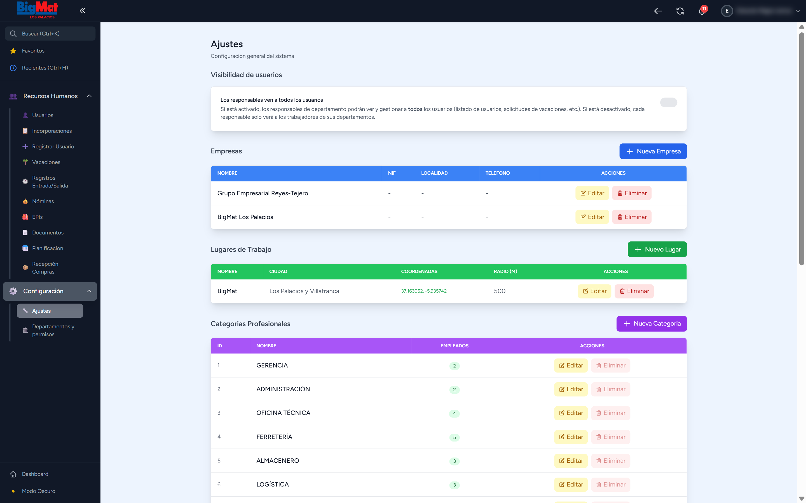

> **Permisos:** Ajustes es una pantalla de **configuración**. Solo acceden los perfiles con **acceso total** (Programador / Administrador / Administración). Los **responsables** y los **operarios no** entran aquí.

### Visibilidad de los responsables

Un único interruptor: **«Los responsables ven a todos los usuarios»**.

- **Activado**: los responsables de departamento pueden **ver y gestionar a todos** los trabajadores (listado, vacaciones, etc.).
- **Desactivado**: cada responsable solo ve a los trabajadores de **sus** departamentos.

No afecta a los administradores (que siempre lo ven todo) ni a los operarios (que solo se ven a sí mismos).

### Empresas

La **empresa** es la entidad empleadora a la que pertenecen los trabajadores. Con **«Nueva Empresa»** se crea; la tabla muestra **Nombre**, **NIF**, **Localidad** y **Teléfono**, con **Editar** y **Eliminar** en cada fila.

El formulario tiene: **Nombre** (obligatorio), **NIF/CIF**, **Nº de Seguridad Social**, **Dirección**, **Localidad**, **Provincia**, **Código Postal**, **Teléfono** y **Email**.

### Lugares de trabajo (obras)

Un **lugar de trabajo** (u «obra») es un centro físico. Es lo que habilita el **fichaje por geolocalización**. Con **«Nuevo Lugar»** se crea; la tabla muestra **Nombre**, **Ciudad**, **Coordenadas** y **Radio (m)**.

El formulario tiene **Nombre** (obligatorio), **Ciudad**, **Dirección** y, en el apartado **«Coordenadas para fichaje»**, la **Latitud**, la **Longitud** y el **Radio permitido en metros** (por defecto **200 m**).

> **Cómo se relaciona con el fichaje:** cuando un trabajador ficha, el sistema compara su posición GPS con la de cada lugar y busca el más cercano. Si está **dentro del radio** de un lugar, el fichaje se admite y queda ligado a esa obra; si no está dentro de ninguno, se rechaza («No estás dentro de ninguna zona de trabajo…»). **Por tanto, configurar las coordenadas y el radio de un lugar es lo que permite fichar allí.** Un lugar **sin coordenadas** no habilita el fichaje.

### Categorías profesionales

La **categoría** es el nivel profesional del trabajador (Oficial 1.ª, Peón, Encargado…). Con **«Nueva Categoría»** se crea; la tabla muestra el **Nombre** y el número de **Empleados** que la tienen. La categoría también se usa en los **convenios** para calcular el salario (ver [capítulo 25](#25-convenios-seguridad-social-e-irpf)).

> No se puede **eliminar** una categoría que tenga **empleados asignados** (el botón aparece deshabilitado).

### Festivos

Los **festivos** definen el calendario laboral. En Ajustes (y también en la sección **Festivos** del panel) se listan los del año en curso por **Fecha** y **Título**. Con **«Nuevo»** se añade uno indicando la **Fecha** y un **Título** (por ejemplo, «Navidad»).

Los festivos se reflejan automáticamente:

- En el **calendario de planificación** y en el de **vacaciones**, pintados en **rojo**.
- En el **cálculo de vacaciones**: los festivos (y los fines de semana) **no cuentan** como días de vacaciones.
- En la **generación automática de turnos**: los días festivos **se respetan** y no se les asigna turno.

## 23. Turnos y plantillas

Los **turnos** definen los horarios de trabajo, y las **plantillas** permiten **rellenar el calendario** de un trabajador de golpe. Ambos se gestionan desde **Ajustes**.

### Tipos de turno

Un **turno** es una franja horaria con nombre (Mañana, Tarde, Noche…). En la sección **«Turnos»** de Ajustes, con **«Nuevo»** se crea uno. El formulario incluye:

- **Nombre del turno**.
- Casilla **«Turno partido»** (dos segmentos horarios): al marcarla aparece un segundo tramo de horas.
- **Hora de inicio** y **Hora de fin**, con un **«Offset de día»** (Día anterior / Mismo día / Día siguiente) para turnos que **cruzan la medianoche** (la salida se imputa al día siguiente).
- **Orden de visualización** (los números más bajos salen primero).
- **Color de fondo** y **color de texto** (con vista previa), que es como se pinta el turno en el calendario.
- Casilla **«Turno activo»**.

La tabla de turnos muestra **Nombre** (con su círculo de color), **Horario** y **Estado**. El badge **Activo / Inactivo** funciona como interruptor: un turno **inactivo no aparece** en el calendario ni se usa al fichar.

### Plantillas de turnos

Una **plantilla** define **qué turno corresponde a cada día de la semana** (lunes a domingo). Sirve para no ir asignando turnos día por día.

En la sección **«Plantillas de Turnos»**, con **«Nueva Plantilla»** se crea una indicando el **Nombre**, una **Descripción** opcional y, para **cada día** (L, M, X, J, V, S, D), qué **turno** se aplica (los días que se dejan vacíos son días que **no se trabaja**). La tabla muestra los días como pastillas de colores y el estado **Activo / Inactivo**.

> No se puede **eliminar** una plantilla que tenga **empleados asignados**.

### Generar los turnos de un trabajador con una plantilla

La plantilla se **aplica** desde el **listado de usuarios**, con el botón **«Turnos»** de cada fila:

1. Elige la **plantilla** que quieras aplicar.
2. Elige el **lugar de trabajo** (obra) que se asignará a esos turnos.
3. Pulsa **«Generar turnos»**.

El sistema **rellena el calendario** de esa persona **desde mañana hasta fin de año** siguiendo la plantilla, asignando el turno y la obra de cada día. Al hacerlo **respeta los festivos**, **no pisa** los días marcados como **vacaciones** y **no sobrescribe** días festivos ya existentes. Termina con un aviso del estilo «Se generaron N turnos hasta fin de año».

### Exportar los registros de entrada/salida

Desde la pantalla **«Asignaciones de Turnos»** (Registros Entrada/Salida) hay un botón de **exportar a Excel** que descarga el fichero **«Registros entrada y salida.xlsx»** respetando los **filtros** activos de la tabla. Las columnas son: **ID Empleado, Empleado, Fecha, Lugar, Turno, Máquina, Entrada, Salida**.

> **Permisos:** turnos, plantillas y exportación son para **oficina / administración**. Los **operarios no acceden**.

## 24. Departamentos, secciones y permisos de acceso

Esta es la pantalla que decide **quién puede ver y hacer qué** en toda la aplicación. Se llama **«Permisos y configuración»** (menú **Configuración → Departamentos y permisos**) y reúne los departamentos, las secciones y los permisos.

> **Permisos:** solo acceden los perfiles con **acceso total**. Un responsable que lo intente recibe «No tienes acceso a la configuración del sistema».

### Cómo funcionan los permisos (los tres niveles)

El acceso a cada pantalla se decide por **niveles de perfil**, no pantalla por pantalla:

1. **Acceso total** — miembros de los departamentos **Programador**, **Administrador** o **Administración**. Acceden a **todo**, incluida la configuración.
2. **Responsables de departamento** — quien figura como **responsable** de algún departamento. Acceden a **casi todo excepto la configuración** (Ajustes, Departamentos, Secciones, Nóminas, IRPF, Seguridad Social, Convenios).
3. **Usuarios básicos / operarios** — el resto. Solo su **propia ficha** y unas pocas acciones (fichar, solicitar vacaciones, pedir revisión de fichajes, mensajes, políticas, descargar su contrato y sus nóminas).

> Pertenecer a un departamento con nombre **Programador**, **Administrador** o **Administración** es lo que otorga el **acceso total**.

### Departamentos

Un **departamento** agrupa empleados y **controla qué áreas (secciones) ve** ese grupo. La pantalla lista los departamentos con sus **Usuarios**, sus **Secciones** y su **Responsable**. Acciones:

- **«+ Nuevo Departamento»** — crea uno con **Nombre** y **Descripción**.
- **«Usuarios»** — abre el selector para **asignar trabajadores** al departamento (con «Invertir selección»). *Al quitar a un usuario, se borran sus permisos sobre las secciones de ese departamento.*
- **«Secciones»** — elige **qué áreas de la app** son visibles para ese departamento.
- **Responsable** — se elige en la tabla «Resumen Departamentos» (o «Sin responsable»). Nombrar a alguien responsable le da el **nivel de responsable** descrito arriba.
- **Editar** (también con doble clic en la fila) y **Eliminar**.

En el detalle de cada departamento, por cada usuario hay tres casillas de **permiso fino** — **Ver**, **Crear** y **Editar** — que se aplican a todas las secciones del departamento.

### Secciones

Una **sección** representa un **área o pantalla** de la aplicación (Usuarios, Nóminas, EPIs…). Sirve para dos cosas: decidir **qué módulos aparecen** en el panel y **a qué áreas** tiene acceso cada departamento.

Como la aplicación crece, hay una ayuda de **sincronización**: el bloque **«Módulos Sin Sección»** detecta áreas nuevas que **todavía nadie puede ver** y permite crearlas con **«Crear Todas»** (o una a una). Las secciones se pueden **reordenar** (arrastrando) y marcar para que aparezcan en el **dashboard** («Página Principal»).

> Tras crear una sección nueva, hay que **asignarla a los departamentos** correspondientes (botón «Secciones» de cada departamento) para que esos usuarios puedan acceder.

Al final de la pantalla, el bloque **«Configuración del Dashboard»** define qué secciones ven en su panel los usuarios con rol **operario**.

# Parte 6 — Nóminas: convenios y cálculo

Además de **importar** las nóminas del mes (ver [capítulo 20](#20-nóminas-contratos-y-despidos)), el sistema puede **calcularlas**. Este cálculo se apoya en cuatro conjuntos de datos —**convenio**, **Seguridad Social**, **IRPF** y **Modelo 145**— y dispone de un **simulador** para estimar sueldos.

## 25. Convenios, Seguridad Social e IRPF

> **Importante.** Estos datos son la base del **cálculo automático** de nóminas. En el estado actual de la aplicación **no tienen una pantalla propia en el menú**: los mantiene el **equipo técnico** directamente en la base de datos. Se documentan aquí para que RRHH entienda **qué significan** y **cómo influyen** en la nómina, no como una pantalla que se edite en el día a día.

### Convenio (retribución por categoría)

El **convenio** define lo que cobra cada **categoría** profesional. Un trabajador **hereda su convenio a través de su categoría** (ver [Categorías](#22-ajustes-empresas-lugares-de-trabajo-categorías-y-festivos)). Contiene:

- **Salario base** (anual).
- **Pluses**: asistencia, actividad, productividad, absentismo y transporte.
- **Prorrateo de pagas extras**.
- **Líquido mínimo pactado**: el **neto** que se garantiza al trabajador.

Al calcular la nómina, el sistema reparte estos importes por meses (divide el anual entre 12) y **ajusta los pluses** al alza o a la baja hasta alcanzar el **líquido mínimo pactado**. El **plus de productividad** solo se aplica a quien esté marcado como **incentivado**.

### Seguridad Social (cotizaciones)

Son los **porcentajes de cotización**, separados entre lo que aporta el **trabajador** y lo que aporta la **empresa**. El sistema suma los porcentajes de cada lado y los aplica sobre el bruto para calcular la **deducción de la Seguridad Social** del trabajador y el **coste de empresa**.

### IRPF (retención)

La **retención de IRPF** se calcula por **tramos** de renta. Los tramos vigentes que aplica el cálculo son:

| Base anual | Retención |
|---|---|
| Hasta 12.450 € | 19 % |
| 12.450 – 20.200 € | 24 % |
| 20.200 – 35.200 € | 30 % |
| 35.200 – 60.000 € | 37 % |
| 60.000 – 300.000 € | 45 % |
| Más de 300.000 € | 47 % |

### Modelo 145 (situación personal y familiar)

El **Modelo 145** recoge la situación personal de cada trabajador (estado civil, **hijos a cargo**, hijos menores de 3 años, ascendientes mayores de 65/75, grado de **discapacidad**, etc.). Sirve para calcular un **mínimo personal y familiar** que **reduce la base** sobre la que se aplica el IRPF: **a más cargas familiares, mayor mínimo y menor retención**.

> Al igual que los anteriores, el Modelo 145 **no se rellena desde una pantalla** en la versión actual; sus datos se cargan en la base de datos. La retención que aparece en la nómina de cada trabajador ya lo tiene en cuenta.

## 26. El simulador de nóminas

El **Simulador de Nómina** es una calculadora para estimar sueldos **sin generar ninguna nómina**. Es útil, por ejemplo, para preparar una oferta a un candidato. Tiene **dos calculadoras** lado a lado.

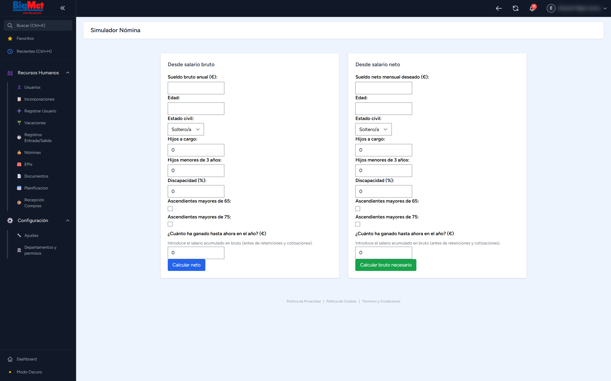

Ambas comparten unos **datos personales** que afinan el cálculo (los mismos conceptos del Modelo 145): **edad**, **estado civil**, **hijos a cargo**, **hijos menores de 3 años**, **discapacidad (%)**, **ascendientes mayores de 65 / 75** y **lo ganado hasta ahora en el año**.

### Del bruto al neto («Desde salario bruto»)

1. Introduce el **sueldo bruto anual (€)**.
2. Rellena los datos personales.
3. Pulsa **«Calcular neto»**.

El resultado aparece en un cuadro con el desglose: **salario mensual bruto**, **Seguridad Social**, **IRPF** y, destacado en verde, el **neto mensual estimado**.

### Del neto al bruto («Desde salario neto»)

1. Introduce el **sueldo neto mensual deseado (€)**.
2. Rellena los datos personales.
3. Pulsa **«Calcular bruto necesario»**.

El sistema **busca** el bruto que produce ese neto y muestra: **salario bruto anual necesario**, **bruto mensual**, **Seguridad Social**, **IRPF** y el **neto mensual**.

> El simulador usa una cotización de Seguridad Social aproximada (~6,35 %) y los tramos de IRPF del capítulo anterior. Es una **estimación**: la nómina real puede variar según los pluses del convenio y la situación exacta del trabajador.

> **Permisos:** el simulador y todo lo relativo al cálculo de nóminas es para perfiles con **acceso total** (Administración / Administrador / Programador). Los **responsables** y **operarios no** acceden.

# Parte 7 — Documentos, integraciones y privacidad

## 27. Contratos y documentos del trabajador

En la ficha de cada trabajador, el panel **«Contratos y Documentos»** reúne su documentación laboral. Se muestra al **propio trabajador** y a la **oficina**.

Actualmente este panel presenta, en **modo consulta**:

- La **Fecha de Incorporación** (vinculada a la incorporación; no se modifica desde aquí).
- La lista de **contratos de la incorporación** («Contrato de Trabajo»), con opción de **verlos**.

> La documentación contractual del trabajador se **aporta y gestiona desde su [ficha de incorporación](#16-la-ficha-de-incorporación-ver-información)** (contratos, prórrogas y demás documentos post-incorporación). El panel de la ficha sirve para **consultarla** de forma rápida. Las **nóminas** van por su propio circuito (ver [capítulo 20](#20-nóminas-contratos-y-despidos)) y no aparecen aquí.

## 28. Recepción de solicitudes de compra (HPR)

**Recepción de Compras** es una pantalla para **recepcionar material** de solicitudes de compra **escaneando un código QR**. Se conecta con **HPR**, un sistema **externo** donde se generan y aprueban las solicitudes: Bigmat **consulta** esos datos y **confirma** la recepción, pero no los almacena.

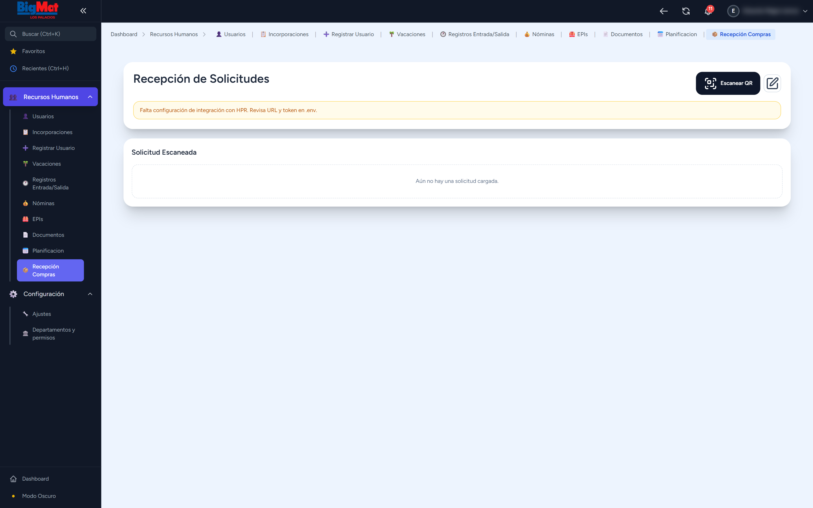

**Cómo se usa:**

1. Pulsa **«Escanear QR»** (abre la cámara y detecta el código automáticamente) o **«Introducir QR manualmente»** (para pegar el código a mano).
2. En **«Solicitud Escaneada»** aparecen los datos de la solicitud (solicitante, artículos, fechas…).
3. Pulsa **«Marcar como recepcionada»**. El sistema registra la recepción a tu nombre. Si ya estaba recepcionada, el botón muestra **«Ya recepcionada»**.

Abajo, **«Solicitudes Recepcionadas»** lista las últimas recepciones sincronizadas con HPR, con botón **«Actualizar»** y **«Ver más»**.

> Si la conexión con HPR no está configurada o no responde, la pantalla muestra un **aviso**: la integración depende de ese sistema externo.

> **Permisos:** pensada para el personal de **almacén / recepción**. Accede quien tenga acceso al panel (acceso total y responsables); los **operarios básicos no**.

## 29. Privacidad y consentimiento

La aplicación exige que cada usuario **acepte las políticas** antes de poder usarla, conforme a la normativa de protección de datos.

### Aceptación obligatoria al entrar

La primera vez (o si aún no ha aceptado), al iniciar sesión aparece la pantalla **«Acepta las políticas para continuar»**, con tres pestañas —**Privacidad**, **Cookies** y **Términos**— y el texto completo de cada una. Hay que marcar las **tres casillas** («Acepto Privacidad», «Acepto Cookies», «Acepto Términos»); hasta entonces el botón **«Aceptar»** está deshabilitado. También existe un enlace **«Salir»** que cierra la sesión.

> **Mientras no se aceptan, el sistema bloquea el acceso** y redirige a esta pantalla. Las páginas de política (privacidad, cookies, términos) son **públicas** y se pueden consultar sin iniciar sesión.

### Revocar el consentimiento

Cada trabajador puede **retirar su consentimiento** cuando quiera, desde el bloque de **políticas de su propia ficha**. Ahí encontrará los enlaces para **consultar** las políticas y el botón **«Revocar consentimiento»**.

Al revocar, el sistema avisa de las consecuencias: **se cierra la sesión automáticamente** y **no se podrá volver a usar la aplicación hasta aceptar de nuevo** las políticas. Se pide confirmación («Sí, revocar» / «Cancelar»).

# Parte 8 — Acceso a la aplicación

## 30. Entrar en la aplicación: acceso y contraseña

Todo empieza aquí: la **pantalla de acceso** es lo primero que ve cualquier persona, tenga el rol que tenga, cada vez que entra en Bigmat. Este capítulo explica cómo **iniciar sesión** y qué hacer cuando **no recuerdas la contraseña** o el sistema te pide **verificar el correo** o **confirmar la contraseña**.

### La pantalla de acceso (login)

En pantallas grandes, la página se divide en **dos mitades**:

- **A la izquierda**, un panel oscuro de presentación con el **logo de Bigmat**, el lema de la plataforma y cuatro rótulos con lo que ofrece: **Gestión de Personal**, **Control de Producción**, **Fichaje de Turnos** e **Informes y Métricas**. Es solo decorativo. En el **móvil** este panel se oculta y en su lugar aparece una cabecera con el logo.
- **A la derecha**, el **formulario** bajo el título **«Iniciar sesión — Ingresa tus credenciales para acceder al sistema»**:
  - **Email** — tu correo electrónico. El cursor se sitúa aquí automáticamente. La aplicación **recuerda el último correo** que escribiste y lo rellena por ti la próxima vez.
  - **Contraseña** — con un icono de **ojo** 👁 a la derecha para **mostrar u ocultar** lo que escribes y comprobar que no hay errores.
  - Enlace **«¿Olvidaste tu contraseña?»** (abajo a la izquierda) — ver [Recuperar la contraseña](#recuperar-la-contraseña-olvidé-mi-contraseña) más abajo.
  - Botón **«Iniciar Sesión»**. Al pulsarlo cambia a **«Iniciando…»** y se bloquea un instante para **evitar pulsaciones dobles**.

> **La sesión se mantiene abierta** aunque cierres el navegador: no hace falta marcar ninguna casilla de «recordarme», ya viene activada. Tendrás que volver a entrar si **cierras sesión** manualmente o si pasa mucho tiempo de inactividad.

**A dónde llegas al entrar** depende de tu perfil (se explica en el [capítulo 21](#21-el-panel-principal-y-la-navegación)): los perfiles de **oficina, administración y responsables** llegan al **Panel principal**; los **operarios** entran directamente a **su ficha** para poder fichar.

**Avisos que pueden aparecer sobre el formulario:**

- **Franja amarilla** — tu sesión **caducó** por inactividad; vuelve a iniciar sesión.
- **Franja azul (informativa)** — por ejemplo, tras **revocar el consentimiento** de las políticas (ver [capítulo 29](#29-privacidad-y-consentimiento)) se te informa de que has cerrado sesión.
- **Texto en rojo** bajo un campo — el **correo o la contraseña no son correctos**. Revisa que el correo esté bien escrito y usa el icono del **ojo** para comprobar la contraseña.

> **¿Qué contraseña uso la primera vez?** Si tu cuenta se creó desde una **incorporación**, la contraseña inicial son **los números de tu DNI** (sin la letra); conviene cambiarla al entrar. Si te dieron de alta por **registro directo**, es la que definió quien te registró (ver [capítulo 8](#8-preguntas-frecuentes)).

### Recuperar la contraseña («Olvidé mi contraseña»)

Si no recuerdas tu contraseña, pulsa **«¿Olvidaste tu contraseña?»** en la pantalla de acceso. Llegas a una página que pide tu **Correo Electrónico**; escríbelo y pulsa **«Restablecer Contraseña»**.

- El sistema **te envía un correo** con un enlace para elegir una contraseña nueva. Aparece un aviso confirmando el envío.
- **Revisa la carpeta de spam** si no lo ves en unos minutos. El correo tiene que ser el que administración tenga registrado en tu ficha.

Al abrir el enlace del correo llegas a la pantalla **«Cambiar contraseña»**, con tu **correo** ya escrito y dos campos: **Contraseña** (la nueva) y **Confirmar Contraseña** (repetida). Pulsa **«Cambiar Contraseña»** y ya podrás entrar con la nueva.

> Si el enlace ha **caducado** o da error, vuelve a la pantalla de acceso y pide otro con **«¿Olvidaste tu contraseña?»**.

### «Confirma tu contraseña» (zona segura)

En algunas acciones sensibles, ya con la sesión iniciada, la aplicación puede pedirte que **vuelvas a escribir tu contraseña** con el mensaje **«Esta es una zona segura de la aplicación…»**. Escríbela y pulsa **«Confirmar»** para continuar. Es una comprobación de seguridad puntual, no un cierre de sesión.

### Verificar el correo electrónico

Si tu cuenta requiere **verificar el correo**, verás la pantalla que te pide **revisar tu email** y hacer clic en el enlace que se te ha enviado. Desde ahí puedes:

- **«Reenviar Email»** — si no te llegó el mensaje, envía uno nuevo (aparece un aviso verde de confirmación).
- **«Cerrar Sesión»** — salir mientras tanto.

### Cerrar sesión

Para salir de forma segura usa **«Cerrar sesión»** desde el menú de la aplicación (en el pie del menú lateral o en el menú de tu perfil). Es lo recomendable en **equipos compartidos**, ya que la sesión permanece abierta entre visitas.

> **Las páginas de políticas** (privacidad, cookies y términos) son **públicas** y se pueden leer **sin iniciar sesión** desde los enlaces del pie o directamente por su dirección (ver [capítulo 29](#29-privacidad-y-consentimiento)).

# Parte 9 — Anexos

## 31. Solución de problemas

Incidencias frecuentes y cómo resolverlas.

### No puedo entrar / he olvidado la contraseña

- **«Estas credenciales no coinciden…»** — el correo o la contraseña son incorrectos. Comprueba el correo y usa el icono del **ojo** 👁 para ver la contraseña mientras la escribes. La primera vez, la contraseña suele ser **los números de tu DNI** (ver [capítulo 30](#30-entrar-en-la-aplicación-acceso-y-contraseña)).
- **He olvidado la contraseña** — pulsa **«¿Olvidaste tu contraseña?»** en la pantalla de acceso y sigue el enlace que llega por correo (revisa el **spam**). Ver [Recuperar la contraseña](#recuperar-la-contraseña-olvidé-mi-contraseña).
- **No me llega el correo de recuperación** — el mensaje va al correo que administración tenga en tu ficha; si no es el tuyo o falta, pídeles que lo actualicen.
- **Me ha echado de repente (franja amarilla)** — la sesión **caducó** por inactividad; vuelve a iniciar sesión.

### No puedo fichar

- **«No estás dentro de ninguna zona de trabajo…»** — estás fuera del **radio** del lugar de trabajo, o ese lugar **no tiene coordenadas** configuradas. Acércate a la obra o pide a administración que revise las **coordenadas y el radio** del [lugar de trabajo](#22-ajustes-empresas-lugares-de-trabajo-categorías-y-festivos).
- **El navegador no pide la ubicación / la deniega** — el fichaje **necesita GPS**. Acepta el permiso de ubicación del navegador; si lo bloqueaste, vuelve a activarlo en los ajustes del sitio.
- **«No tienes permisos para fichar»** — fichar es solo para perfiles **operario** y **oficina**.
- **«Ya has completado el turno partido de hoy»** — ya están registrados los cuatro marcajes del día; no se pueden añadir más.
- Si te has equivocado con una hora, no la corrijas fichando de nuevo: **pide una revisión de fichajes** (ver [capítulo 17](#17-fichajes-y-revisión-de-fichajes)).

### No me llega la nómina

- La nómina **se envía por correo**, no se descarga en pantalla. Revisa la carpeta de **spam**.
- **«No tienes un correo electrónico configurado»** — falta tu email; contacta con el departamento de **programador**.
- **«No se encontró ninguna nómina para el mes…»** — administración aún no ha **importado** las nóminas de ese mes (ver [capítulo 20](#20-nóminas-contratos-y-despidos)).

### No veo el menú lateral o algunas secciones

- El **menú lateral** solo se muestra a perfiles de **oficina / administración**. Los **operarios** entran directamente a su ficha.
- Una opción con un **candado** significa que tu perfil **no tiene permiso** para esa sección. Los **responsables** no ven la **Configuración** (Ajustes, Departamentos). Si necesitas acceso, pídelo a administración (ver [capítulo 24](#24-departamentos-secciones-y-permisos-de-acceso)).
- **«No tienes acceso a la configuración del sistema.»** — eres responsable e intentas entrar en una pantalla de configuración; solo los perfiles de **acceso total** entran ahí.

### La aplicación me pide aceptar las políticas

Es obligatorio aceptar **privacidad, cookies y términos** para poder usar la aplicación. Marca las tres casillas y pulsa **Aceptar** (ver [capítulo 29](#29-privacidad-y-consentimiento)). Si antes **revocaste** el consentimiento, tendrás que volver a aceptarlas.

### No encuentro a un trabajador en los listados

- Puede estar **despedido**: los dados de baja **no aparecen** en los listados generales, solo en la vista **Despedidos** (ver [capítulo 20](#20-nóminas-contratos-y-despidos)).
- Si eres **responsable**, quizá ese trabajador **no es de tus departamentos**. La visibilidad depende del ajuste **«Los responsables ven a todos los usuarios»** (ver [capítulo 22](#22-ajustes-empresas-lugares-de-trabajo-categorías-y-festivos)).

### El calendario o una pantalla no carga bien

- Usa el botón **refrescar** de la barra superior, o vuelve a entrar desde el menú.
- Si acabas de subir un documento o justificante y no lo ves, **refresca** la pantalla.

### Un aviso de mensajes que no desaparece

La **campana** cuenta las **conversaciones sin leer**. Basta con **abrir** el mensaje para marcarlo como leído; el contador se actualiza solo (ver [capítulo 18](#18-mensajes-internos-y-firma-de-documentos)).

## 32. Preguntas frecuentes (uso diario)

Respuestas rápidas a las dudas más habituales, agrupadas por tema. Para el alta de trabajadores, consulta también las [preguntas frecuentes de la Parte 1](#8-preguntas-frecuentes).

### Acceso y contraseña

**¿Cómo entro la primera vez?**
Con tu **correo** y, como contraseña inicial, **los números de tu DNI** (sin la letra) si te dieron de alta por incorporación. Conviene cambiarla al entrar (ver [capítulo 30](#30-entrar-en-la-aplicación-acceso-y-contraseña)).

**He olvidado mi contraseña.**
En la pantalla de acceso pulsa **«¿Olvidaste tu contraseña?»**, escribe tu correo y sigue el enlace que te llega por email (revisa el **spam**).

**¿Cómo cambio mi contraseña?**
Desde tu propia ficha, en la vista de **Configuración / Administración de Perfil**, con **«Actualizar contraseña»** (ver [capítulo 13](#13-mi-perfil)).

**¿Por qué la aplicación me pide aceptar las políticas?**
Es obligatorio aceptar **privacidad, cookies y términos** para poder usarla. Marca las tres casillas y pulsa **Aceptar** (ver [capítulo 29](#29-privacidad-y-consentimiento)).

**¿Se cierra sola la sesión?**
La sesión se mantiene abierta entre visitas; solo se cierra si **sales manualmente** o tras mucho tiempo de inactividad. En equipos compartidos, cierra sesión al terminar.

### Fichajes

**¿Cómo ficho la entrada y la salida?**
Desde **tu propia ficha** («Mi perfil»), con los botones grandes de fichaje. El sistema usa el **GPS** para comprobar que estás en la zona de trabajo (ver [capítulo 17](#17-fichajes-y-revisión-de-fichajes)).

**No me deja fichar: «No estás dentro de ninguna zona de trabajo».**
Estás fuera del **radio** de la obra o esa obra no tiene coordenadas. Acércate al lugar o pide a administración que revise las coordenadas y el radio (ver [Solución de problemas](#31-solución-de-problemas)).

**Me he equivocado en una hora, ¿cómo la corrijo?**
No fiches de nuevo: **pide una revisión de fichajes** y administración la corrige (ver [capítulo 17](#17-fichajes-y-revisión-de-fichajes)).

**¿Quién puede fichar?**
Solo los perfiles **operario** y **oficina**.

### Vacaciones

**¿Cómo pido vacaciones?**
Desde el **calendario de tu ficha**, seleccionando los días y enviando la solicitud a la oficina (ver [capítulo 14](#14-vacaciones-solicitud-y-aprobación)).

**¿Cuántos días me corresponden?**
Dependen del **cupo anual** y de tu **fecha de incorporación** (si entraste a mitad de año, se prorratean). El sistema no te deja solicitar más de los que te quedan.

**¿Quién aprueba mis vacaciones?**
La **oficina**, desde su panel de vacaciones. Hasta que se aprueban, la solicitud queda **pendiente**.

**¿Puedo anular una solicitud?**
Sí, mientras esté pendiente puedes eliminarla; una vez aprobada, habla con la oficina para reorganizarla.

### Ausencias y justificantes

**¿Cómo subo un justificante?**
Desde tu ficha, en el día correspondiente, adjuntando el documento que acredita la ausencia (ver [capítulo 15](#15-justificantes-y-control-de-ausencias)).

**¿Qué diferencia hay entre falta justificada e injustificada?**
La **justificada** va acompañada de un motivo/justificante; la **injustificada** no. En ambos casos la oficina puede añadir un **comentario** con el motivo.

**¿Quién puede subir justificantes?**
El propio trabajador (operario/oficina) sobre sus días; la oficina puede además consultarlos y gestionarlos.

### Nóminas

**¿Dónde veo mi nómina?**
La nómina **se envía por correo electrónico**, no se descarga en pantalla. Revisa tu email (y la carpeta de **spam**) (ver [capítulo 20](#20-nóminas-contratos-y-despidos)).

**No me ha llegado la nómina.**
Puede que administración aún no la haya **importado** ese mes, o que falte tu correo en la ficha. Comprueba el spam y, si no, avisa a administración.

**¿Cómo se calcula mi sueldo?**
A partir del **convenio** asociado a tu **categoría** profesional, más las cotizaciones de Seguridad Social y la retención de IRPF (ver [capítulo 25](#25-convenios-seguridad-social-e-irpf)).

**¿Qué es el simulador de nóminas?**
Una herramienta de la oficina para estimar el **neto desde el bruto** (o al revés) sin generar una nómina real (ver [capítulo 26](#26-el-simulador-de-nóminas)).

### Mensajes y firmas

**¿Qué es la campana de arriba?**
Es la **mensajería interna**: el número indica las **conversaciones sin leer**. Al **abrir** el mensaje se marca como leído y el contador baja solo (ver [capítulo 18](#18-mensajes-internos-y-firma-de-documentos)).

**Tengo un aviso de mensajes que no se quita.**
Abre la conversación pendiente; el contador se actualiza automáticamente al leerla.

**¿Cómo firmo un documento que me han enviado?**
Desde el mensaje con el documento adjunto, usando la opción de **firma** (ver [capítulo 18](#18-mensajes-internos-y-firma-de-documentos)).

### EPIs

**¿Dónde veo los EPIs que me han entregado?**
En la pantalla de **EPIs por trabajador**; cada persona tiene su agenda de equipos asignados (ver [capítulo 19](#19-epis-equipos-de-protección-individual)).

**¿Cómo asigno un EPI a un trabajador? *(oficina)***
Desde la ficha del trabajador en EPIs, eligiéndolo del **catálogo**; también se pueden **importar desde Excel** y registrar **compras**.

### Mi perfil y mis datos

**¿Cómo cambio mi foto de perfil?**
Desde tu ficha, subiendo una imagen (ver [capítulo 13](#13-mi-perfil)).

**¿Cómo veo mi calendario de turnos?**
En tu ficha aparece el **calendario** con tus turnos, fichajes y estados de cada día (ver [capítulo 11](#11-la-ficha-del-trabajador)).

**¿Puedo pedir una nómina anterior?**
Sí, desde tu propia ficha con **«Solicitar nómina»**; llegará a tu correo (ver [capítulo 13](#13-mi-perfil)).

### Permisos y visibilidad

**No veo el menú lateral.**
El menú lateral es para perfiles de **oficina/administración**; los **operarios** entran directamente a su ficha (ver [Solución de problemas](#31-solución-de-problemas)).

**Una opción del menú tiene un candado.**
Tu perfil **no tiene permiso** para esa sección. Los **responsables** no ven la **Configuración**; si necesitas acceso, pídelo a administración (ver [capítulo 24](#24-departamentos-secciones-y-permisos-de-acceso)).

**No encuentro a un trabajador en los listados.**
Puede estar **despedido** (solo aparece en la vista Despedidos) o, si eres responsable, **no pertenecer a tus departamentos** (ver [Solución de problemas](#31-solución-de-problemas)).

### Gestión (oficina y RR. HH.)

**¿Cómo doy de alta a un trabajador?**
Lo recomendable es crear una **incorporación** y enviarle el enlace para que rellene sus datos; para casos puntuales, **Registrar Usuario** directamente (ver [capítulos 4 y 5](#4-vía-recomendada-incorporación-con-enlace)).

**¿Cómo despido o readmito a un trabajador?**
Con **«Despedir trabajador»** en su ficha; para readmitir, entra en la vista **Despedidos** del listado de usuarios (ver [capítulo 20](#20-nóminas-contratos-y-despidos)).

**¿Cómo genero de golpe los turnos de un trabajador?**
Con una **plantilla de turnos** aplicada desde el listado de usuarios (botón **Turnos**) (ver [capítulo 23](#23-turnos-y-plantillas)).

**¿Cómo exporto el listado de usuarios?**
Con el botón **Exportar a Excel** de la cabecera del listado; respeta los **filtros** activos (ver [capítulo 10](#10-el-listado-de-usuarios)).

**¿Cómo cambio el nombre de un departamento?**
En **Departamentos**, pulsa **«Editar»** en la fila (o doble clic en la tabla resumen): el nombre se edita **en línea** y se guarda con **«Guardar»** (ver [capítulo 24](#24-departamentos-secciones-y-permisos-de-acceso)).

### Preferencias

**¿Cómo activo el modo oscuro?**
Con el conmutador **Modo Oscuro / Modo Claro** del pie del menú lateral; la aplicación recuerda tu elección (ver [capítulo 34](#34-atajos-de-teclado-y-preferencias)).

**¿Hay atajos de teclado?**
Sí, para los perfiles con menú lateral: **Ctrl + K** (buscador), **Ctrl + B** (menú), **Ctrl + H** (recientes) y **Esc** (cerrar) (ver [capítulo 34](#34-atajos-de-teclado-y-preferencias)).

## 33. Glosario de términos

| Término | Qué significa |
|---|---|
| **Usuario** | La cuenta de una persona en la aplicación (con la que inicia sesión, ficha, etc.). |
| **Incorporación** | El expediente de alta de una persona: sus datos y toda su documentación. Cada alta genera un usuario y su incorporación. |
| **Ficha del trabajador** | La pantalla que reúne los datos, el calendario y las acciones sobre una persona. «Mi perfil» es tu propia ficha. |
| **Empresa** | La entidad empleadora a la que pertenece el trabajador. |
| **Lugar de trabajo (obra)** | Un centro físico. Si tiene coordenadas y radio, habilita el **fichaje por geolocalización** en esa ubicación. |
| **Categoría** | El nivel profesional del trabajador (Oficial 1.ª, Peón…). Determina su convenio. |
| **Turno** | Una franja horaria con nombre (Mañana, Tarde, Noche…) y color. |
| **Plantilla de turnos** | Una configuración que asigna un turno a cada día de la semana, para **generar turnos** de golpe. |
| **Asignación de turno** | El turno (o estado) de un trabajador en un día concreto, con sus horas de fichaje. |
| **Estado (de un día)** | La situación de un día: activo, injustificada, justificada, baja, vacaciones o curso. |
| **Fichaje** | El registro de entrada/salida. Un día está **completo** si tiene entrada y salida. |
| **Justificante** | El documento que acredita una ausencia justificada. |
| **Departamento** | Un grupo de empleados que además define qué **secciones** ve ese grupo. |
| **Sección** | Un área o pantalla de la aplicación, usada para conceder accesos. |
| **Responsable** | Quien está al frente de un departamento; accede a casi todo excepto a la configuración. |
| **Acceso total** | Perfil de los departamentos Programador, Administrador y Administración: accede a todo. |
| **Convenio** | La retribución (salario base y pluses) asociada a una categoría. |
| **Modelo 145** | Los datos personales y familiares del trabajador que afectan a la retención de IRPF. |
| **EPI** | Equipo de Protección Individual (guantes, casco, botas…). |
| **HPR** | Sistema externo de solicitudes de compra con el que se integra la Recepción de Compras. |
| **Alerta / Mensaje** | La mensajería interna de la aplicación. |

## 34. Atajos de teclado y preferencias

### Atajos de teclado

Disponibles para los perfiles con menú lateral (oficina / administración):

| Atajo | Acción |
|---|---|
| **Ctrl + K** | Abrir el **buscador global** |
| **Ctrl + B** | Abrir / cerrar el **menú lateral** |
| **Ctrl + H** | Ver los elementos **recientes** |
| **Esc** | Cerrar el cuadro o modal abierto |

Además, el menú lateral incluye accesos a **Favoritos** y **Recientes** para volver rápido a las pantallas que más usas.

### Modo oscuro

En el pie del menú lateral hay un conmutador **Modo Oscuro / Modo Claro**. La aplicación recuerda tu elección.

### Otras preferencias que la aplicación recuerda

- La **última vista y fecha** del calendario (semana/día/mes) en la planificación y en la ficha.
- La **última vista** usada en las pantallas que lo permiten.

---

*Bigmat — Manual de usuario · Alta y gestión de trabajadores · Documento de uso interno.*
